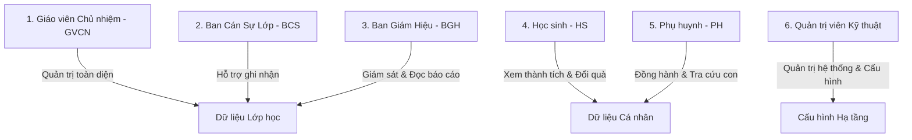
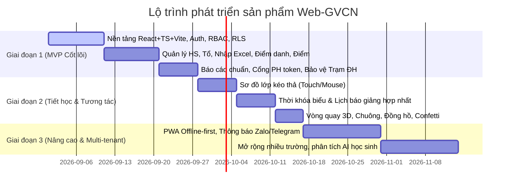

# TÀI LIỆU YÊU CẦU SẢN PHẨM (PRODUCT REQUIREMENTS DOCUMENT - PRD)
**Tên sản phẩm:** Nền tảng Quản trị Lớp học & Đồng hành Học sinh (Web-GVCN)  
**Phiên bản:** 2.0 (Chuyển đổi từ Prototype Index.html sang Production Web App)  
**Tác giả:** AI Lead Engineer & Product Architect  
**Trạng thái:** Chờ chủ dự án duyệt kiến trúc  

---

## 1. TỔNG QUAN SẢN PHẨM (EXECUTIVE SUMMARY)
Web-GVCN là hệ thống ứng dụng web chuyên biệt dành cho **Giáo viên Chủ nhiệm (GVCN)** trường phổ thông tại Việt Nam. Ứng dụng giải quyết triệt để các nỗi đau về ghi chép sổ sách giấy, phân tán dữ liệu lớp học, thiếu minh bạch trong thi đua và khó khăn trong việc phối hợp ba bên: **Nhà trường – Giáo viên – Gia đình**.

Phiên bản 2.0 chuyển đổi toàn bộ nguyên mẫu đơn tệp (`Index.html`) sang kiến trúc hiện đại **React + TypeScript + Vite + Supabase + Tailwind CSS**, đảm bảo:
- **Đồng bộ thời gian thực** trên mọi thiết bị (Laptop giảng dạy, Điện thoại di động GVCN & Phụ huynh).
- **Phân quyền dữ liệu thực tế (Row Level Security - RLS)**, xóa bỏ cơ chế mật khẩu tĩnh và lưu trữ tạm bợ ở trình duyệt.
- **Bảo mật tuyệt đối thông tin học sinh** theo Nghị định 13/2023/NĐ-CP và Luật Trẻ em.

---

## 2. CHÂN DUNG NGƯỜI DÙNG & VAI TRÒ HỆ THỐNG (USER PERSONAS)

### 2.1. Giáo viên Chủ nhiệm (GVCN) - Người dùng hạt nhân (Primary Persona)
- **Nhu cầu:** Điểm danh nhanh đầu giờ; ghi nhận điểm thi đua khen thưởng/vi phạm tức thì; xếp sơ đồ lớp; tạo báo cáo tuần gửi BGH; lưu giữ nhật ký đồng hành học sinh cá biệt/hoàn cảnh khó khăn.
- **Môi trường sử dụng:** Laptop tại lớp học (kết nối máy chiếu/màn hình tương tác), Smartphone khi đi kiểm tra hoặc ở nhà.

### 2.2. Ban Cán Sự Lớp (BCS) - Người dùng hỗ trợ (Secondary Persona)
- **Nhu cầu:** Lớp trưởng, lớp phó, tổ trưởng điểm danh tổ viên, ghi nhận sao tốt/lỗi vi phạm trong giờ truy bài theo ủy quyền của GVCN.
- **Giới hạn:** Không được sửa hồ sơ bạn học, không được xem Trạm đồng hành, không được xóa dữ liệu lịch sử.

### 2.3. Ban Giám Hiệu (BGH) - Người dùng giám sát
- **Nhu cầu:** Xem báo cáo chuyên cần, nền nếp thi đua của các lớp trong khối/toàn trường; nắm bắt tổng quan tình hình giáo dục.
- **Giới hạn:** Mặc định chỉ đọc (Read-only), không can thiệp sửa đổi sổ điểm danh hoặc giao dịch điểm của lớp.

### 2.4. Phụ huynh / Người giám hộ (PH) - Người dùng tra cứu & liên kết
- **Nhu cầu:** Nắm bắt tình hình chuyên cần của con (con đã vào lớp chưa, có nghỉ học không); xem điểm thưởng, nhận xét của GVCN; đăng ký đổi quà khích lệ con.
- **Giới hạn:** Tuyệt đối chỉ xem thông tin của con mình; không xem điểm hay nhận xét của học sinh khác.

### 2.5. Học sinh (HS) - Người dùng tương tác & thụ hưởng
- **Nhu cầu:** Xem bảng xếp hạng tổ, xem số sao tích lũy cá nhân, danh mục quà tặng trong Shop sao lớp.
- **Giới hạn:** Chỉ xem điểm cá nhân và thông tin công khai chung của lớp.

### 2.6. Quản trị viên Hệ thống (System Admin)
- **Nhu cầu:** Quản trị trường, niên khóa, phân lớp cho giáo viên, kiểm tra sao lưu và giám sát bảo mật hệ thống.

---

## 3. MỤC TIÊU ĐO LƯỜNG ĐƯỢC (MEASURABLE GOALS & OKRS)

| Mục tiêu | Chỉ số đo lường (Metric / KPI) | Ngưỡng kỳ vọng (Target) |
|---|---|---|
| **Tốc độ & Hiệu năng** | Thời gian tải trang ban đầu (FCP) trên 4G | $\le 1.2$ giây |
| | Điểm Google Lighthouse (Performance, A11y, Best Practices) | $\ge 90/100$ |
| **Độ tin cậy dữ liệu** | Tỷ lệ dữ liệu đồng bộ thành công giữa Laptop và Điện thoại | $100\%$ qua Supabase Realtime/Postgres |
| | Độ chính xác báo cáo (Loại bỏ 100% fake data `Math.sin`) | Sai số = 0 (Tính chuẩn 100% từ ledger) |
| **Bảo mật & An toàn** | Điểm lỗ hổng bảo mật nghiêm trọng (Critical/High) | 0 lỗ hổng (Zero Vulnerabilities) |
| | Tỷ lệ học sinh bị lộ dữ liệu nhạy cảm chéo | $0\%$ (Bảo vệ bởi RLS & mã hóa) |
| **Thời gian thao tác của GV**| Thời gian hoàn thành điểm danh cả lớp | $\le 15$ giây |
| | Thời gian ghi 1 lượt tích điểm khen thưởng | $\le 5$ giây |

---

## 4. PHÂN KỲ TRIỂN KHAI: MVP VS PHASES SAU VS NGOÀI PHẠM VI

### 4.1. Phạm vi phiên bản tối thiểu (MVP - Phase 1 - Bắt buộc)
1. **Nền tảng & Bảo mật:**
   - Đăng nhập/Đăng xuất/Đổi mật khẩu với Supabase Auth.
   - Hệ thống bảng đa thực thể (Multi-tenant ready: `schools`, `classes`, `academic_years`, `students`).
   - Phân quyền RLS nghiêm ngặt cho 6 vai trò.
2. **Quản lý học sinh & Tổ:**
   - Danh sách học sinh, phân tổ 1-4, hồ sơ chi tiết.
   - Nhập danh sách từ Excel có màn hình Preview, báo lỗi dòng và kiểm tra trùng lặp.
   - Tải ảnh đại diện lên Private Supabase Storage (không dùng base64 localStorage).
3. **Điểm danh & Điểm thi đua (Ledger):**
   - Điểm danh theo ngày (Có mặt, Muộn, Phép, Không phép).
   - Form cộng/trừ điểm đa năng (Học sinh, Tổ, Cả lớp) theo danh mục tiêu chí.
   - Sổ giao dịch điểm Append-only; hoàn tác điểm bằng giao dịch đảo (Reversal).
   - Shop sao đổi quà (trừ sao minh bạch khi đổi quà).
4. **Báo cáo số liệu thực:**
   - Thống kê tuần, tháng, học kỳ tính toán trực tiếp từ bảng giao dịch và điểm danh.
   - Xuất file PDF bảng tổng hợp in ấn đẹp mắt.
5. **Cổng Phụ huynh bảo mật:**
   - Xem thông tin học sinh qua liên kết tài khoản hoặc Token bảo mật có thời hạn/thu hồi (xóa bỏ mã 5 số cố định).
6. **Trạm đồng hành (Phiên bản bảo mật cao):**
   - Lưu trữ tiến trình hỗ trợ học sinh có vấn đề (Issues -> Interventions -> Updates -> Closed).
   - Chỉ GVCN của lớp được truy cập; phân quyền RLS chặn toàn bộ BCS, PH và học sinh khác.

### 4.2. Giai đoạn 2 (Phase 2 - Phục hồi công cụ lớp học trực tiếp)
1. **Sơ đồ chỗ ngồi thông minh:** Bố trí ma trận bàn học, kéo thả học sinh, tự động sắp xếp xen kẽ nam/nữ, hỗ trợ cảm ứng trên điện thoại/máy tính bảng.
2. **Thời khóa biểu & Lịch báo giảng:** Hợp nhất 3 hàm báo giảng thành 1 module chuẩn, parse dữ liệu Excel TKB vào cơ sở dữ liệu có cấu trúc.
3. **Bộ công cụ lớp học trực tiếp:** Vòng quay ngẫu nhiên (3D/Card Picker), Đồng hồ đếm ngược/bấm giờ, Chuông âm thanh Synthesizer (Tone.js), Hiệu ứng pháo hoa ăn mừng (Canvas Confetti).

### 4.3. Giai đoạn 3 (Phase 3 - Mở rộng nâng cao)
1. **PWA Offline-first:** Điểm danh và ghi điểm ngay cả khi mất mạng internet trong lớp học, tự động đồng bộ khi có mạng lại.
2. **Kênh thông báo tự động:** Gửi thông báo chuyên cần và điểm thi đua qua Zalo ZNS / Telegram Bot cho phụ huynh.
3. **Báo cáo phân tích thông minh:** Đồ thị đường xu hướng học tập/hành vi, cảnh báo sớm học sinh có nguy cơ sa sút.

### 4.4. Ngoài phạm vi dự án (Out of Scope)
- Không xây dựng cổng thanh toán trực tuyến tiền học phí.
- Không xây dựng nền tảng học trực tuyến (LMS / Video streaming).
- Không tự chấm bài kiểm tra trắc nghiệm bằng quét hình ảnh OCR trong phiên bản này.

---

## 5. CÁC QUY TẮC NGHIỆP VỤ BẮT BUỘC (BUSINESS RULES)

1. **Quy tắc Sổ cái điểm thi đua (Append-only Point Ledger):**
   - Tuyệt đối không có lệnh `DELETE` hay `UPDATE` âm thầm trên trường tổng điểm của học sinh.
   - Mọi thay đổi điểm phải là một dòng ghi trong `point_transactions` gồm: `student_id`, `points` (+/-), `stars` (+/-), `category_id`, `reason`, `occurred_at`, `created_by`.
   - Khi GVCN muốn "xóa" hoặc hoàn tác 1 lỗi nhập sai, hệ thống tạo một bản ghi đảo (Reversal Transaction) mang giá trị ngược dấu và lưu tham chiếu `reversal_of_id`.
2. **Quy tắc Tính toán Thời gian Thực (Real-time Computed Aggregation):**
   - Điểm tổng, số sao hiện có, thứ hạng tổ, tiến bộ tuần/tháng PHẢI được tính tổng (SUM) từ các bản ghi giao dịch thật. Cấm tuyệt đối việc tạo số liệu ngẫu nhiên hoặc dùng hàm giả lập `Math.sin`.
3. **Quy tắc Bảo mật Dữ liệu Riêng tư của Trẻ em:**
   - Dữ liệu "Trạm đồng hành" (vấn đề vi phạm, hoàn cảnh đặc biệt) là dữ liệu nhạy cảm cấp cao. Chỉ tài khoản GVCN chủ nhiệm lớp đó mới được cấp quyền giải mã và đọc dữ liệu.
   - Ban cán sự lớp khi đăng nhập sẽ không thấy menu, không nhận được API response chứa dữ liệu này.
4. **Quy tắc Điểm danh Chuyên cần:**
   - Mỗi ngày học chỉ có 1 phiên điểm danh chính (`attendance_sessions`).
   - Bản ghi trạng thái (`attendance_records`) lưu rõ: trạng thái (`present`, `late`, `excused_absence`, `unexcused_absence`), thời gian ghi nhận và người thực hiện.
5. **Quy tắc Nhận diện Lớp học & Theme:**
   - Banner và màu sắc chủ đề tháng thuộc quyền cấu hình của GVCN. Ảnh tải lên phải được lưu trữ trong Storage bucket với đường dẫn chuẩn hóa theo `class_id`, có giới hạn dung lượng ($\le 2$ MB) và kiểm tra định dạng an toàn.

---

## 6. TIÊU CHÍ NGHIỆM THU QUAN SÁT ĐƯỢC (OBSERVABLE ACCEPTANCE CRITERIA)

| Mã tiêu chí | Nghiệp vụ kiểm thử | Hành vi quan sát được kỳ vọng (Expected Behavior) |
|---|---|---|
| **AC-01** | Khởi động & Đăng nhập | Người dùng chưa đăng nhập khi mở trang web bắt buộc phải thấy giao diện Đăng nhập Supabase Auth; không thể truy cập dashboard bằng cách sửa URL. |
| **AC-02** | Phân quyền Ban cán sự | Đăng nhập tài khoản BCS -> Không xuất hiện menu "Trạm đồng hành", "Cài đặt nâng cao", "Xóa lớp". Thử gọi trực tiếp API qua DevTools nhận lỗi `403 Forbidden` do RLS chặn. |
| **AC-03** | Điểm danh 1 chạm | Bấm "Điểm danh nhanh cả lớp" -> Toàn bộ danh sách chuyển sang màu xanh "Có mặt", số liệu thống kê chuyên cần trên Header và Dashboard nhảy số chính xác ngay lập tức. |
| **AC-04** | Cộng điểm & Đổi quà | Thực hiện cộng 10 điểm cho Tổ 1 -> Tất cả thành viên trong Tổ 1 được tăng 10 điểm và 10 sao trong sổ cái; bảng xếp hạng Tổ tự động nhảy thứ hạng theo điểm mới. |
| **AC-05** | Hoàn tác giao dịch điểm | Bấm nút "Hoàn tác" ở một dòng lịch sử điểm -> Xuất hiện dòng ghi chú đảo màu đỏ gạch ngang; số dư điểm của học sinh giảm tương ứng mà lịch sử kiểm toán vẫn được lưu trữ đầy đủ. |
| **AC-06** | Nhập danh sách Excel | Kéo thả file `.xlsx` 45 học sinh -> Hiển thị bảng Xem trước (Preview) với đầy đủ Tên, Giới tính, Ngày sinh, Tổ; bấm "Xác nhận nhập" -> 45 bản ghi được ghi vào DB trong $\le 2$ giây. |
| **AC-07** | Phụ huynh tra cứu con | Phụ huynh quét mã QR / Token liên kết của con -> Chỉ thấy duy nhất bảng điểm, chuyên cần và nhận xét của con mình; không thể xem hoặc sửa thông tin của học sinh khác. |
