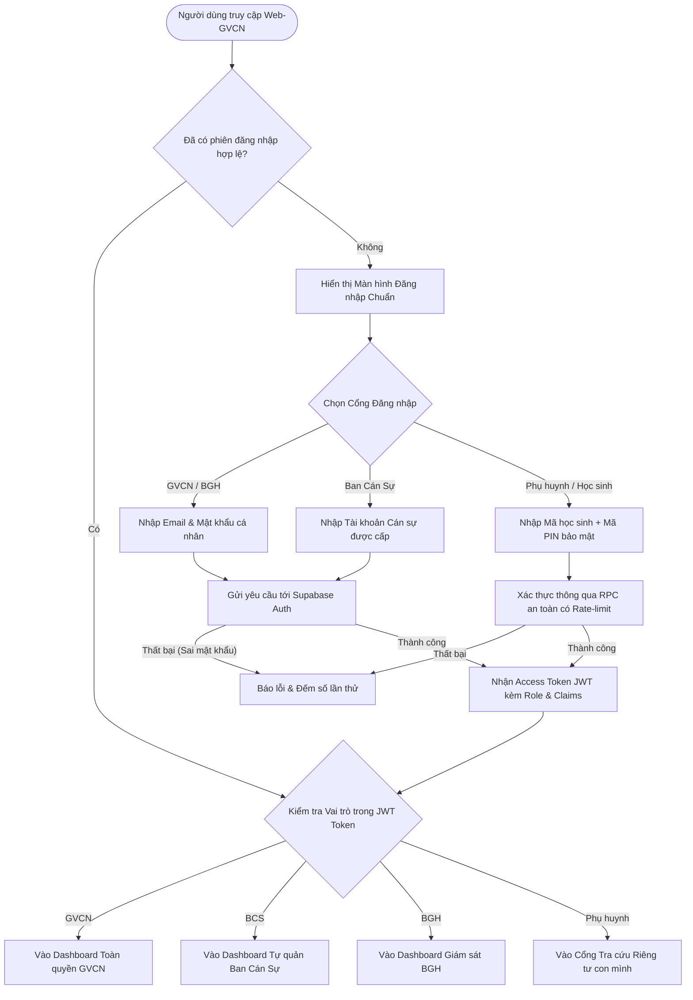
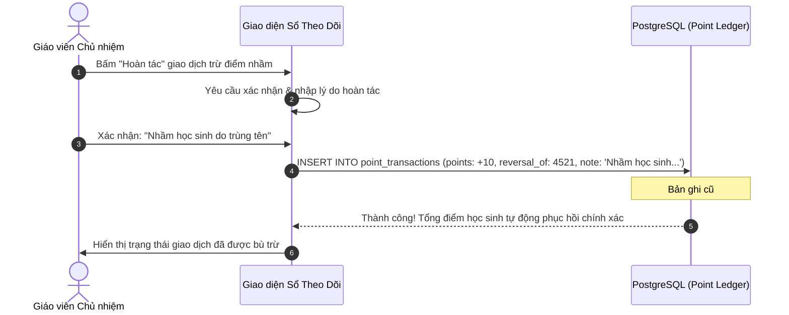

# 🔐 MA TRẬN PHÂN QUYỀN & CÁC LUỒNG NGƯỜI DÙNG (RBAC & USER FLOWS)
**Dự án:** Web-GVCN (Hệ thống Quản lý Lớp học dành cho Giáo viên Chủ nhiệm)  
**Tác giả:** AI Lead Engineer & Product Architect  
**Ngày ban hành:** 11/09/2026  
**Trạng thái:** DỰ THẢO KIẾN TRÚC – CHỜ CHỦ DỰ ÁN DUYỆT

---

## 1. MA TRẬN PHÂN QUYỀN DỮ LIỆU CHI TIẾT (RBAC MATRIX)

Để khắc phục triệt để lỗ hổng "Phân quyền hình thức chỉ ẩn menu trên trình duyệt" của nguyên mẫu cũ, hệ thống mới áp dụng mô hình **Kiểm soát truy cập dựa trên vai trò kết hợp chính sách hàng dữ liệu (Role-Based Access Control + Row Level Security)**.

### Ký hiệu quyền:
- **R (Read):** Xem dữ liệu.
- **C (Create):** Tạo mới dữ liệu.
- **U-Own (Update Own):** Chỉ được sửa bản ghi do chính mình tạo ra trong phiên làm việc.
- **U-All (Update All):** Sửa bất kỳ bản ghi nào trong lớp.
- **A (Approve):** Duyệt hoặc khóa sổ dữ liệu.
- **E (Export):** Xuất báo cáo ra PDF hoặc Excel.
- **SD (Soft Delete):** Đánh dấu xóa mềm (ẩn khỏi giao diện nhưng không mất dữ liệu).
- **RES (Restore):** Khôi phục bản ghi đã xóa mềm.
- **❌ (Deny):** Hoàn toàn bị cấm (chặn từ tầng cơ sở dữ liệu PostgreSQL).

---

### BẢNG MA TRẬN PHÂN QUYỀN THEO ĐỐI TƯỢNG VÀ VAI TRÒ

| Phân hệ / Đối tượng dữ liệu | GVCN (Chủ nhiệm) | BCS (Ban cán sự) | BGH (Giám hiệu) | Học sinh | Phụ huynh | Admin (Kỹ thuật) |
|:---|:---:|:---:|:---:|:---:|:---:|:---:|
| **1. Hồ sơ Học sinh** (Thông tin, ảnh, tổ) | R, C, U-All, E, SD, RES | R (Chỉ xem) | R (Chỉ xem) | R (Chỉ xem mình) | R (Chỉ xem con) | R, E (Bảo trì) |
| **2. Điểm danh Chuyên cần** | R, C, U-All, A, E, SD | R, C, U-Own (Trong ngày) | R, E | R (Chỉ xem mình) | R (Chỉ xem con) | R |
| **3. Sổ cái Giao dịch Điểm** (Tích điểm) | R, C, U-All, A, E, SD, RES | R, C (Theo tiêu chí) | R, E | R (Chỉ xem mình) | R (Chỉ xem con) | R |
| **4. Tiêu chí Chấm điểm** (Bảng 40 tiêu chí) | R, C, U-All, SD | R (Chỉ xem) | R (Chỉ xem) | R (Chỉ xem) | R (Chỉ xem) | R |
| **5. Danh mục Quà tặng & Đổi sao** | R, C, U-All, A, SD | R, C (Gợi ý đổi) | R | R, C (Gửi yêu cầu đổi) | R | R |
| **6. Sơ đồ Lớp học & Chỗ ngồi** | R, C, U-All, SD | R (Chỉ xem) | R (Chỉ xem) | R (Chỉ xem) | R (Chỉ xem) | R |
| **7. Thời khóa biểu & Lịch báo giảng** | R, C, U-All, E, SD | R (Chỉ xem) | R, E | R (Chỉ xem TKB) | R (Chỉ xem TKB) | R |
| **8. Kế hoạch tuần & Nhiệm vụ** | R, C, U-All, SD | R, U-Own (Nhiệm vụ giao) | R | R (Chỉ xem) | R (Chỉ xem) | R |
| **9. TRẠM ĐỒNG HÀNH (Tối mật)** | **R, C, U-All, SD, RES** | ❌ **Tuyệt đối cấm** | R (Khi có thẩm quyền) | ❌ **Tuyệt đối cấm** | ❌ **Tuyệt đối cấm** | ❌ (Chỉ xem audit log) |
| **10. Cài đặt Lớp & Nhận diện** | R, U-All | ❌ | R (Chỉ xem) | ❌ | ❌ | R, U-All |
| **11. Nhật ký Thao tác (Audit Logs)** | R, E | ❌ | R, E | ❌ | ❌ | R, E, SD (Lưu trữ) |

---

## 2. SITEMAP CHI TIẾT THEO TỪNG VAI TRÒ (ROLE-BASED SITEMAP)

### 2.1. Sitemap dành cho Giáo viên Chủ nhiệm (Toàn quyền quản trị lớp)
```text
[GVCN Dashboard]
├── 🏠 Trang chủ: Tổng quan sĩ số, chuyên cần hôm nay, Top thi đua tuần, Lịch học hôm nay
├── 👥 Học sinh: Danh sách lớp, Hồ sơ chi tiết, Thêm/Sửa/Xóa, Nhập Excel, Xuất Excel
├── 📅 Điểm danh: Điểm danh buổi sáng/chiều, Lịch sử chuyên cần theo tháng, Báo cáo vắng
├── ⭐ Tích điểm & Thi đua:
│   ├── Chấm điểm nhanh (Cá nhân, Tổ, Cả lớp)
│   ├── Sổ cái giao dịch điểm & Hoàn tác
│   └── Xếp hạng tổ thi đua theo tuần/tháng
├── 🗺️ Sơ đồ lớp: Sơ đồ chỗ ngồi tương tác, Kéo thả đổi chỗ, Xếp tự động, Mở rộng dãy
├── 🎁 Quà tặng: Danh mục phần thưởng, Duyệt yêu cầu đổi quà của học sinh
├── 🛠️ Trợ giảng số: Vòng quay ngẫu nhiên (gọi tên), Đồng hồ đếm ngược có chuông
├── 📖 Lịch báo giảng & TKB: Xem/sửa lịch báo giảng theo tuần, Nhập TKB từ Excel
├── 📝 Kế hoạch tuần: Nhiệm vụ Ban cán sự, Lịch sự kiện, Chủ điểm tháng
├── 📊 Sổ theo dõi & Báo cáo: Tổng hợp chuyên cần, Báo cáo nề nếp, Xuất PDF in ấn
├── 🤝 Trạm đồng hành (Khu vực bảo mật): Hồ sơ theo dõi học sinh đặc biệt, Biện pháp can thiệp
└── ⚙️ Cài đặt & Dữ liệu: Đổi tên lớp, Banner, Quản lý tài khoản Ban cán sự, Sao lưu/Phục hồi
```

### 2.2. Sitemap dành cho Ban Cán Sự Lớp (Quyền tự quản được ủy nhiệm)
```text
[BCS Dashboard]
├── 🏠 Trang chủ: Thông báo lớp, Nhiệm vụ được giao trong tuần
├── 📅 Điểm danh nhanh: Điểm danh đầu giờ theo buổi (chỉ trong ngày hiện tại)
├── ⭐ Chấm điểm thi đua: Chấm điểm học tập/nề nếp theo 40 tiêu chí được phân công
├── 🗺️ Sơ đồ lớp: Xem sơ đồ chỗ ngồi của lớp (chế độ chỉ đọc)
├── 📖 Thời khóa biểu: Xem thời khóa biểu lớp trong tuần
├── 🛠️ Công cụ lớp học: Đồng hồ bấm giờ làm bài, Vòng quay gọi tên hoạt động nhóm
└── 📋 Nhật ký tự quản: Ghi nhận việc tốt, báo cáo tuần ngắn gọn gửi GVCN
*(Lưu ý: Không có quyền truy cập Trạm Đồng Hành, Hồ sơ riêng tư, Cài đặt lớp)*
```

### 2.3. Sitemap dành cho Phụ huynh / Học sinh (Tra cứu an toàn)
```text
[Cổng Phụ Huynh / Học Sinh]
├── 📊 Bảng nỗ lực cá nhân:
│   ├── Tổng số sao tích lũy & Thứ hạng nỗ lực (không so sánh tiêu cực)
│   ├── Lịch sử ghi nhận điểm cộng/trừ chi tiết (ngày, lý do, người ghi nhận)
│   └── Tình hình chuyên cần của con trong tháng
├── 📅 Thời khóa biểu lớp & Kế hoạch tuần của lớp
├── 🎁 Cửa hàng quà tặng: Danh sách phần thưởng & Đăng ký đổi quà bằng sao
└── 💬 Kênh phản hồi: Gửi lời nhắn riêng tư đến Giáo viên Chủ nhiệm
```

---

## 3. BIỂU ĐỒ LUỒNG NGƯỜI DÙNG CHÍNH (KEY USER FLOWS)

### 3.1. Luồng Xác thực & Đăng nhập Hệ thống (Authentication Flow)


---

### 3.2. Luồng Chấm điểm Thi đua & Ghi Sổ cái Bất biến (Point Ledger Flow)
```mermaid
sequenceDiagram
    autonumber
    actor Actor as GVCN hoặc Ban Cán Sự
    participant UI as Giao diện Web (React UI)
    participant Client as Supabase Client (Vite)
    participant DB as PostgreSQL (Point Ledger)
    participant RT as Supabase Realtime (WebSocket)

    Actor->>UI: Chọn Học sinh / Tổ + Chọn Tiêu chí (+5đ Đạt điểm tốt)
    UI->>UI: Kiểm tra tính hợp lệ dữ liệu (Zod Schema Validation)
    UI->>Client: Gửi giao dịch điểm (student_id, points, reason, category)
    Client->>DB: INSERT INTO point_transactions (created_by, points, ...)
    Note over DB: RLS kiểm tra: Cán sự chỉ được chấm đúng danh mục được giao
    DB-->>Client: Trả về bản ghi vừa tạo thành công (Transaction #4521)
    DB->>RT: Phát broadcast sự kiện 'point_created'
    RT-->>UI: Cập nhật thời gian thực trên màn hình GVCN & BCS
    UI->>Actor: Hiển thị Toast thông báo: "Đã cộng 5 điểm cho Lê Ngọc Anh"
```

---

### 3.3. Luồng Hoàn tác Điểm sai (Point Reversal Flow - Append-Only)


---

### 3.4. Luồng Bảo vệ Dữ liệu Tuyệt mật "Trạm Đồng Hành"
```mermaid
flowchart TD
    Request[Yêu cầu đọc dữ liệu Trạm Đồng Hành] --> CheckAuth{Người dùng đã đăng nhập?}
    CheckAuth -- Không --> Deny401[Trả về 401 Unauthorized]
    CheckAuth -- Có --> CheckRLS{Kiểm tra chính sách RLS trên bảng companion_cases}
    
    CheckRLS -- Người dùng là BCS / Học sinh / Khách --> Deny403[Chặn ngay tại Database - Trả về mảng rỗng []]
    CheckRLS -- Người dùng là GVCN của lớp đó --> Allow200[Cho phép đọc dữ liệu & Giải mã thông tin]
    
    Allow200 --> RenderUI[Hiển thị Hồ sơ Đồng hành trên Giao diện GVCN]
    Deny403 --> LogSecurity[Ghi vết vào bảng audit_logs: Cảnh báo truy cập trái phép]
```

---

### 3.5. Luồng Điểm danh Chuyên cần Hằng ngày
```mermaid
flowchart TD
    StartDD[Bắt đầu điểm danh lớp] --> SelectDate[Chọn ngày & buổi học: Sáng / Chiều]
    SelectDate --> LoadList[Tải danh sách học sinh theo sơ đồ lớp]
    LoadList --> DefaultStatus[Trạng thái mặc định: 100% Có mặt]
    
    DefaultStatus --> MarkAbsent{Học sinh nào vắng?}
    MarkAbsent -- Vắng có phép --> SetP[Đánh dấu: Có phép (P)]
    MarkAbsent -- Vắng không phép --> SetKP[Đánh dấu: Không phép (KP) - Bật cảnh báo]
    MarkAbsent -- Đi trễ --> SetT[Đánh dấu: Đi trễ (T) - Ghi chú số phút]
    
    SetP --> SaveAttendance[Bấm nút: Lưu & Khóa sổ điểm danh]
    SetKP --> SaveAttendance
    SetT --> SaveAttendance
    
    SaveAttendance --> SaveDB[(Lưu vào attendance_sessions & records)]
    SaveDB --> SyncNotify[Đồng bộ sang điện thoại GVCN]
```

---

## 4. QUY TRÌNH XỬ LÝ NGOẠI LỆ (EXCEPTION HANDLING FLOWS)

1. **Mất kết nối Internet khi đang đứng lớp (Offline Graceful Handling):**
   - Ứng dụng phát hiện trạng thái `navigator.onLine === false`.
   - Hiển thị thanh thông báo nhỏ màu vàng: *"Đang hoạt động ngoại tuyến. Các thao tác điểm danh/tích điểm sẽ được lưu tạm và tự động đồng bộ khi có mạng"*.
   - Sử dụng IndexedDB/Memory Queue để lưu các hành động chờ gửi (Pending Actions) và tự động đồng bộ lại khi kết nối internet được khôi phục.
2. **Xung đột sửa dữ liệu đồng thời (Concurrent Edit Conflict):**
   - Khi 2 cán sự cùng sửa điểm danh của 1 học sinh cùng lúc, hệ thống sử dụng cơ chế **Optimistic Concurrency Control (Kiểm soát đồng thời lạc quan)** dựa trên trường `updated_at` để ngăn chặn việc ghi đè âm thầm.
3. **Phiên đăng nhập hết hạn (Token Expiration):**
   - Tự động làm mới Token ngầm qua Supabase SDK mà không làm gián đoạn việc giáo viên đang nhập liệu.
   - Nếu làm mới thất bại, hệ thống lưu tạm bản nháp (draft form) trước khi chuyển hướng về màn hình đăng nhập.
4. **Nhập tệp Excel sai cấu trúc:**
   - Kiểm tra sơ bộ định dạng cột bằng Zod Schema trước khi xử lý. Nếu thiếu cột "Họ và tên" hoặc "Tổ", hiển thị modal chỉ rõ vị trí dòng lỗi thay vì làm sập toàn bộ ứng dụng.

---
*Tài liệu này xác định ranh giới bảo mật và luồng tương tác thực tế của hệ thống Web-GVCN. Tiếp theo là tài liệu Kiến trúc Dữ liệu & Bảo mật tại `docs/03-data-and-security-architecture.md`.*
