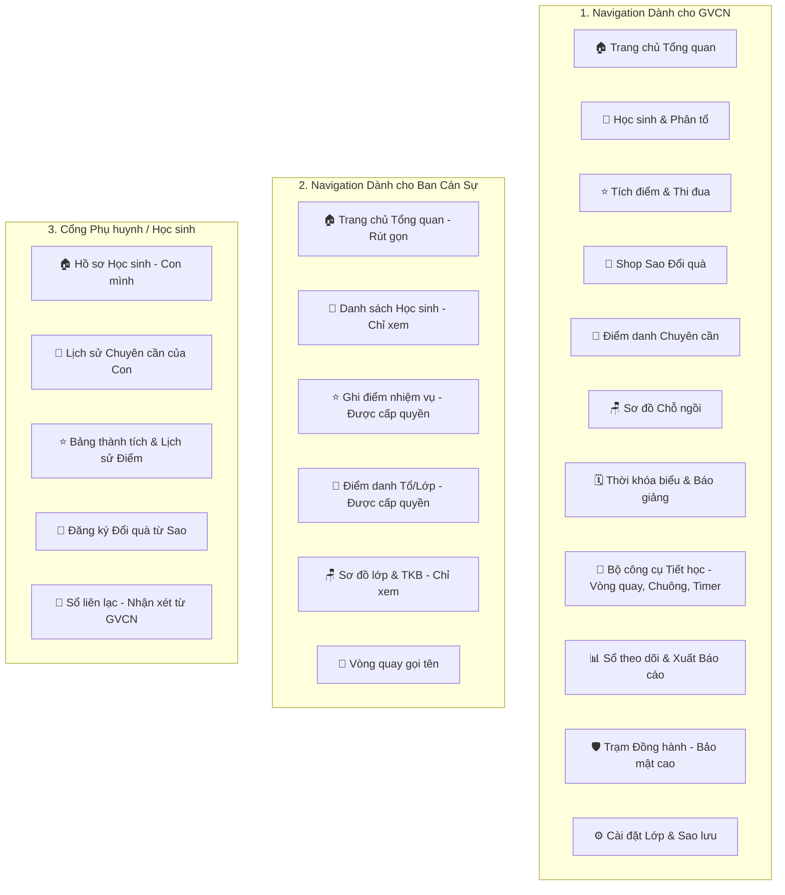
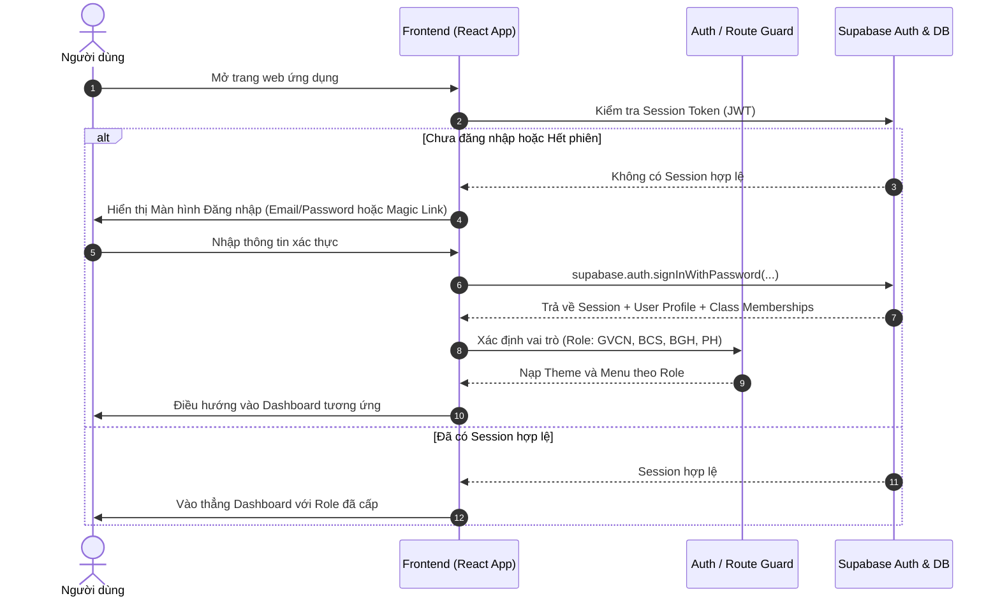
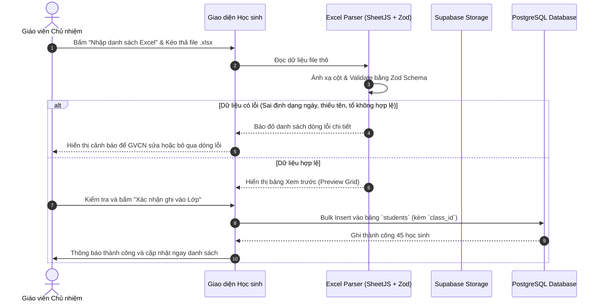
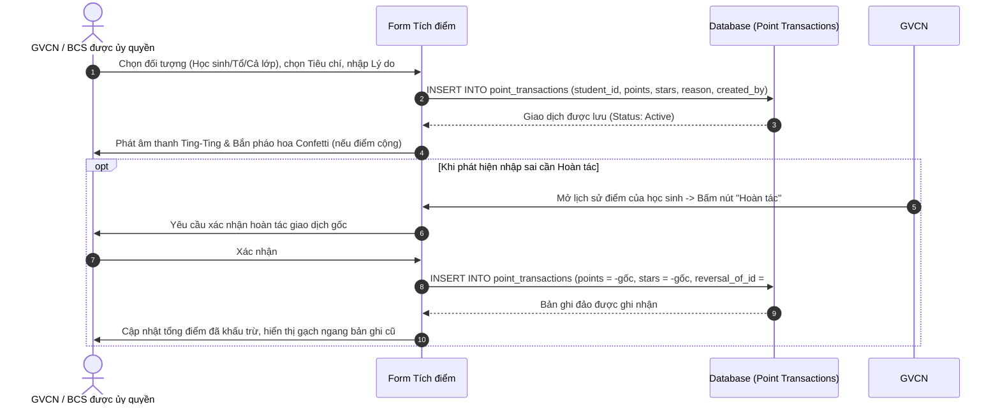
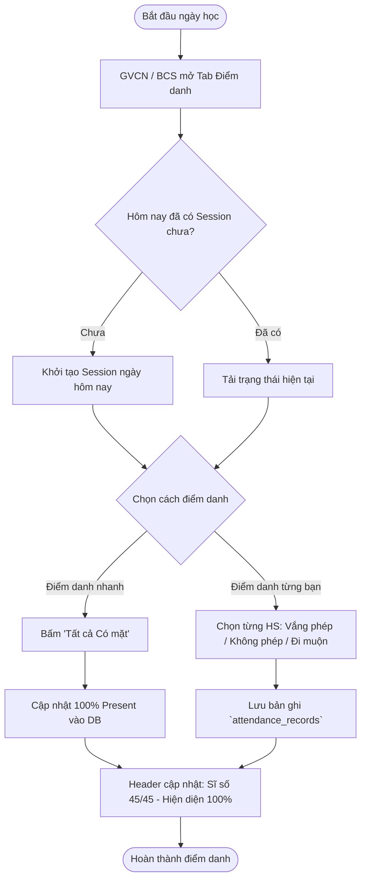
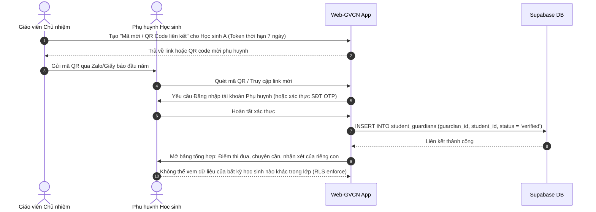

# MA TRẬN PHÂN QUYỀN & LUỒNG THAO TÁC NGƯỜI DÙNG (RBAC & USER FLOWS)
**Dự án:** Hệ thống Quản trị Lớp học Web-GVCN (Bản Production)  
**Tác giả:** AI Lead Engineer & Product Architect  
**Trạng thái:** Chờ chủ dự án duyệt kiến trúc  

---

## 1. MA TRẬN PHÂN QUYỀN TOÀN DIỆN (RBAC MATRIX)

Ký hiệu:
- ✅ **Toàn quyền / Có phép**
- 🔶 **Phép có điều kiện / Phạm vi giới hạn** (vd: chỉ sửa của mình tạo, chỉ xem con mình)
- ❌ **Cấm tuyệt đối**

| Tài nguyên / Nghiệp vụ | Thao tác | 1. GVCN (Chủ nhiệm) | 2. BCS (Ban cán sự) | 3. BGH (Ban giám hiệu) | 4. Học sinh | 5. Phụ huynh | 6. Quản trị viên (Admin) |
|---|---|:---:|:---:|:---:|:---:|:---:|:---:|
| **Hồ sơ lớp & Nhận diện** | Xem cấu hình | ✅ | ✅ | ✅ | ✅ | ✅ | ✅ |
| (Banner, Tên lớp, Slogan) | Cập nhật / Tải ảnh | ✅ | ❌ | ❌ | ❌ | ❌ | ✅ |
| **Danh sách học sinh** | Xem danh sách | ✅ | ✅ | ✅ | 🔶 (Công khai lớp) | 🔶 (Chỉ xem con) | ✅ |
| (Tên, ngày sinh, tổ, avatar)| Thêm / Sửa / Nhập Excel | ✅ | ❌ | ❌ | ❌ | ❌ | ✅ |
| | Xóa mềm / Khôi phục | ✅ | ❌ | ❌ | ❌ | ❌ | ✅ |
| **Giao dịch Điểm thi đua** | Xem sổ điểm | ✅ | ✅ | ✅ | 🔶 (Chỉ điểm mình) | 🔶 (Chỉ điểm con) | ✅ |
| (Cộng/Trừ điểm, Đổi quà) | Ghi nhận điểm mới | ✅ | 🔶 (Nếu GV cấp quyền) | ❌ | ❌ | ❌ | ❌ |
| | Hoàn tác (Tạo Reversal)| ✅ | ❌ | ❌ | ❌ | ❌ | ❌ |
| **Điểm danh Chuyên cần** | Xem bảng điểm danh | ✅ | ✅ | ✅ | 🔶 (Chỉ ngày mình) | 🔶 (Chỉ ngày con) | ✅ |
| | Điểm danh theo ngày | ✅ | 🔶 (Nếu GV cấp quyền) | ❌ | ❌ | ❌ | ❌ |
| **Sơ đồ chỗ ngồi & TKB** | Xem sơ đồ, TKB | ✅ | ✅ | ✅ | ✅ | ✅ | ✅ |
| | Xếp chỗ, Kéo thả, Sửa TKB| ✅ | ❌ | ❌ | ❌ | ❌ | ❌ |
| **Lịch báo giảng** | Xem lịch dạy | ✅ | ✅ | ✅ | ❌ | ❌ | ✅ |
| | Lập / Sửa lịch dạy | ✅ | ❌ | ❌ | ❌ | ❌ | ❌ |
| **Báo cáo & Xuất PDF** | Xem tổng hợp tuần/tháng| ✅ | 🔶 (Xem bảng điểm) | ✅ | ❌ | ❌ | ✅ |
| | Xuất file PDF / Excel | ✅ | ❌ | ✅ | ❌ | ❌ | ✅ |
| **Trạm đồng hành (Nhạy cảm)**| Xem hồ sơ hỗ trợ | ✅ | ❌ CẤM | 🔶 (Nếu được duyệt)| ❌ CẤM | ❌ CẤM | ❌ CẤM (Trừ Audit) |
| (Vi phạm, can thiệp, tâm lý) | Tạo mới / Cập nhật ca | ✅ | ❌ CẤM | ❌ CẤM | ❌ CẤM | ❌ CẤM | ❌ CẤM |
| | Đóng hồ sơ (Completed) | ✅ | ❌ CẤM | ❌ CẤM | ❌ CẤM | ❌ CẤM | ❌ CẤM |
| **Liên kết Phụ huynh** | Tạo mã mời / QR Code | ✅ | ❌ | ❌ | ❌ | ❌ | ✅ |
| | Kích hoạt liên kết | ❌ | ❌ | ❌ | ❌ | ✅ | ❌ |

---

## 2. SITEMAP ĐIỀU HƯỚNG THEO TỪNG VAI TRÒ (ROLE-BASED SITEMAP)

---

## 3. LUỒNG THAO TÁC NGƯỜI DÙNG CHI TIẾT (USER FLOWS)

### 3.1. Luồng Xác thực & Đăng nhập Hệ thống (Auth Flow)

---

### 3.2. Luồng Quản lý Học sinh & Nhập danh sách từ Excel

---

### 3.3. Luồng Tích điểm & Hoàn tác Giao dịch (Point Ledger & Reversal Flow)

---

### 3.4. Luồng Điểm danh Chuyên cần theo ngày

---

### 3.5. Luồng Cổng Phụ huynh Liên kết & Tra cứu (Secure Parent Flow)

---

### 3.6. Luồng Xử lý Ngoại lệ, Mất mạng & Lỗi Phiên (Error & Resilience Flows)

1. **Mất kết nối Internet khi đang trên lớp (Offline Resilience):**
   - Khi mất mạng, giao diện hiển thị thanh Banner vàng cảnh báo: *"Đang mất kết nối Internet. Thao tác điểm danh tạm thời được lưu cục bộ trên bộ nhớ đệm an toàn (IndexedDB)."*
   - Khi có kết nối trở lại, hệ thống tự động đẩy hàng đợi (Sync Queue) lên Supabase và hiển thị Toast xanh thông báo hoàn tất.
2. **Hết hạn phiên đăng nhập (Session Expired):**
   - Supabase SDK tự động làm mới JWT qua Refresh Token ở chế độ nền.
   - Nếu Refresh Token hết hạn (quá 30 ngày), modal nhỏ yêu cầu nhập lại mật khẩu hiện lên ngay trên màn hình hiện tại mà không làm mất dữ liệu form đang nhập dở.
3. **Cố tình truy cập trái phép đường dẫn URL (Unauthorized Route Access):**
   - Nếu tài khoản BCS hoặc PH gõ trực tiếp URL `/companion` (Trạm đồng hành), `PermissionGuard` chặn ngay lập tức và điều hướng về `/403-forbidden` kèm thông báo: *"Bạn không có quyền truy cập khu vực này. Sự việc đã được ghi nhận vào nhật ký kiểm toán."*
