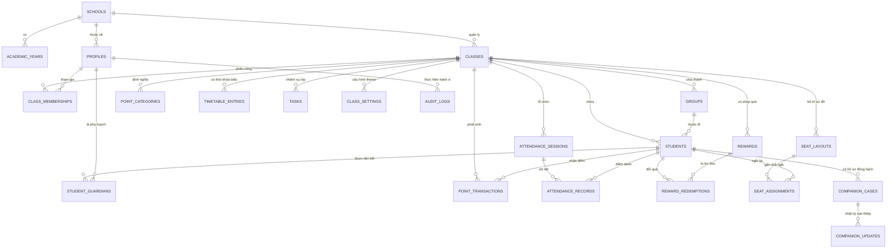

# KIẾN TRÚC DỮ LIỆU & AN TOÀN BẢO MẬT (DATA & SECURITY ARCHITECTURE)
**Dự án:** Hệ thống Quản trị Lớp học Web-GVCN (Bản Production)  
**Tác giả:** AI Lead Engineer & Education Data Security Specialist  
**Trạng thái:** Chờ chủ dự án duyệt kiến trúc  

---

## 1. SƠ ĐỒ THỰC THỂ LIÊN KẾT KHÁI NIỆM (CONCEPTUAL ERD)



---

## 2. ĐẶC TẢ CHI TIẾT CÁC BẢNG DỮ LIỆU (RELATIONAL SCHEMA SPECIFICATION)

Toàn bộ bảng sử dụng khóa chính dạng `UUID` (`gen_random_uuid()`), có trường theo dõi thời gian `created_at`, `updated_at`, và trường `deleted_at` phục vụ xóa mềm (Soft Delete).

### 2.1. Nhóm Bảng Tổ chức & Người dùng (Multi-tenant Foundation)
1. **`schools`**: Danh mục trường học.
   - `id` (UUID, PK), `name` (TEXT), `code` (TEXT, Unique), `address` (TEXT), `logo_url` (TEXT), `created_at` (TIMESTAMPTZ).
2. **`academic_years`**: Niên khóa học tập.
   - `id` (UUID, PK), `school_id` (UUID, FK), `name` (TEXT, vd: "2026 - 2027"), `start_date` (DATE), `end_date` (DATE), `is_active` (BOOLEAN).
3. **`profiles`**: Hồ sơ người dùng (ánh xạ 1-1 với `auth.users`).
   - `id` (UUID, PK, FK `auth.users.id`), `full_name` (TEXT), `phone` (TEXT), `avatar_url` (TEXT), `email` (TEXT), `system_role` (TEXT: `admin`, `teacher`, `student`, `parent`).
4. **`classes`**: Danh mục lớp học.
   - `id` (UUID, PK), `school_id` (UUID, FK), `academic_year_id` (UUID, FK), `name` (TEXT, vd: "12A1"), `grade_level` (INT: 10, 11, 12), `banner_url` (TEXT), `theme_config` (JSONB), `deleted_at` (TIMESTAMPTZ).
5. **`class_memberships`**: Phân công vai trò của người dùng trong từng lớp.
   - `id` (UUID, PK), `class_id` (UUID, FK), `profile_id` (UUID, FK), `role` (TEXT: `gvcn`, `bancansu`, `bgh_viewer`), `permissions` (JSONB), `created_at` (TIMESTAMPTZ).

### 2.2. Nhóm Bảng Học sinh & Phụ huynh
6. **`groups`**: Tổ thi đua trong lớp (Tổ 1, 2, 3, 4).
   - `id` (UUID, PK), `class_id` (UUID, FK), `name` (TEXT), `color_class` (TEXT), `avatar_url` (TEXT), `order_index` (INT).
7. **`students`**: Danh sách học sinh.
   - `id` (UUID, PK), `class_id` (UUID, FK), `group_id` (UUID, FK, Nullable), `full_name` (TEXT), `gender` (TEXT: `Nam`, `Nữ`), `birth_date` (DATE), `class_role` (TEXT: `Thành viên`, `Lớp trưởng`, `Lớp phó`, `Tổ trưởng`), `avatar_url` (TEXT), `goals` (TEXT), `talents` (TEXT), `boarding_type` (TEXT), `deleted_at` (TIMESTAMPTZ).
8. **`student_guardians`**: Quan hệ liên kết Phụ huynh - Học sinh.
   - `id` (UUID, PK), `student_id` (UUID, FK), `guardian_profile_id` (UUID, FK), `relationship` (TEXT: `Bố`, `Mẹ`, `Người giám hộ`), `invite_token` (TEXT, Unique), `token_expires_at` (TIMESTAMPTZ), `status` (TEXT: `pending`, `active`, `revoked`).

### 2.3. Nhóm Bảng Điểm thi đua & Sổ cái (Point Ledger System)
9. **`point_categories`**: Danh mục tiêu chí cộng/trừ điểm.
   - `id` (UUID, PK), `class_id` (UUID, FK), `type` (TEXT: `add`, `subtract`), `category_group` (TEXT: `Học tập`, `Nề nếp`, `Phong trào`, `Đột xuất`), `title` (TEXT), `default_points` (INT), `default_stars` (INT).
10. **`point_transactions`**: Sổ cái giao dịch điểm (Append-Only Ledger).
    - `id` (UUID, PK), `class_id` (UUID, FK), `student_id` (UUID, FK), `category_id` (UUID, FK, Nullable), `points` (INT, +/-), `stars` (INT, +/-), `reason` (TEXT), `note` (TEXT), `occurred_at` (TIMESTAMPTZ), `created_by` (UUID, FK `profiles.id`), `reversal_of_id` (UUID, FK `point_transactions.id`, Nullable).

### 2.4. Nhóm Bảng Chuyên cần & Điểm danh
11. **`attendance_sessions`**: Phiên điểm danh theo ngày.
    - `id` (UUID, PK), `class_id` (UUID, FK), `session_date` (DATE), `session_type` (TEXT: `morning`, `afternoon`), `created_by` (UUID, FK `profiles.id`), `is_locked` (BOOLEAN).
12. **`attendance_records`**: Chi tiết điểm danh từng học sinh.
    - `id` (UUID, PK), `session_id` (UUID, FK), `student_id` (UUID, FK), `status` (TEXT: `present`, `late`, `excused_absence`, `unexcused_absence`), `note` (TEXT), `updated_by` (UUID, FK `profiles.id`).

### 2.5. Nhóm Bảng Shop Đổi quà, Sơ đồ, Thời khóa biểu & Tiết học
13. **`rewards`**: Quà tặng trong shop sao.
    - `id` (UUID, PK), `class_id` (UUID, FK), `name` (TEXT), `star_cost` (INT), `stock_quantity` (INT), `image_url` (TEXT), `is_active` (BOOLEAN).
14. **`reward_redemptions`**: Lịch sử đổi quà.
    - `id` (UUID, PK), `class_id` (UUID, FK), `student_id` (UUID, FK), `reward_id` (UUID, FK), `stars_spent` (INT), `status` (TEXT: `requested`, `approved`, `delivered`, `cancelled`), `created_at` (TIMESTAMPTZ).
15. **`seat_layouts`**: Cấu hình sơ đồ phòng học.
    - `id` (UUID, PK), `class_id` (UUID, FK), `layout_name` (TEXT), `rows` (INT), `cols` (INT), `is_current` (BOOLEAN).
16. **`seat_assignments`**: Vị trí chỗ ngồi của học sinh.
    - `id` (UUID, PK), `layout_id` (UUID, FK), `student_id` (UUID, FK), `row_index` (INT), `col_index` (INT), `is_hidden` (BOOLEAN).
17. **`timetable_entries`**: Dữ liệu thời khóa biểu & Báo giảng.
    - `id` (UUID, PK), `class_id` (UUID, FK), `day_of_week` (INT: 2-7, CN), `period` (INT: 1-10), `subject_name` (TEXT), `lesson_topic` (TEXT), `teacher_name` (TEXT), `notes` (TEXT).
18. **`tasks`**: Danh sách việc cần làm / Checklist của lớp.
    - `id` (UUID, PK), `class_id` (UUID, FK), `title` (TEXT), `is_completed` (BOOLEAN), `priority` (TEXT: `low`, `normal`, `high`), `due_date` (DATE).

### 2.6. Nhóm Bảng Nhạy cảm "Trạm Đồng Hành" (Highly Sensitive Data)
19. **`companion_cases`**: Hồ sơ học sinh cần hỗ trợ đặc biệt.
    - `id` (UUID, PK), `class_id` (UUID, FK), `student_id` (UUID, FK), `start_date` (DATE), `status` (TEXT: `active`, `monitoring`, `completed`), `severity_level` (TEXT: `low`, `medium`, `critical`), `primary_concern` (TEXT), `action_plan` (TEXT), `created_by` (UUID, FK), `deleted_at` (TIMESTAMPTZ).
20. **`companion_updates`**: Nhật ký tiến trình can thiệp & làm việc với phụ huynh.
    - `id` (UUID, PK), `case_id` (UUID, FK), `update_date` (DATE), `observation_notes` (TEXT), `interaction_summary` (TEXT, vd: "Gặp phụ huynh lần 2"), `created_by` (UUID, FK).

### 2.7. Nhóm Bảng Nhật ký Kiểm toán (Audit Logs)
21. **`audit_logs`**: Nhật ký bảo mật toàn hệ thống.
    - `id` (UUID, PK), `actor_id` (UUID, FK), `action` (TEXT: `LOGIN`, `READ_SENSITIVE`, `UPDATE_GRADE`, `DELETE_STUDENT`, `EXPORT_REPORT`), `target_resource` (TEXT), `target_id` (UUID), `ip_address` (TEXT), `user_agent` (TEXT), `payload` (JSONB), `created_at` (TIMESTAMPTZ).

---

## 3. MA TRẬN CHÍNH SÁCH ROW LEVEL SECURITY (RLS POLICY MATRIX)

Mọi bảng nghiệp vụ BẮT BUỘC bật `ALTER TABLE ... ENABLE ROW LEVEL SECURITY;`.

```sql
-- Ví dụ: Hàm kiểm tra quyền GVCN của lớp
CREATE OR REPLACE FUNCTION is_class_gvcn(target_class_id UUID) 
RETURNS BOOLEAN AS $$
BEGIN
  RETURN EXISTS (
    SELECT 1 FROM class_memberships 
    WHERE class_id = target_class_id 
      AND profile_id = auth.uid() 
      AND role = 'gvcn'
  );
END;
$$ LANGUAGE plpgsql SECURITY DEFINER;
```

| Tên Bảng | Vai trò áp dụng | Quyền hạn (SELECT / INSERT / UPDATE / DELETE) | Biểu thức Policy (RLS Using / With Check) |
|---|---|---|---|
| **`classes`** | Thành viên lớp (GVCN, BCS, BGH) | `SELECT` | `id IN (SELECT class_id FROM class_memberships WHERE profile_id = auth.uid())` |
| | GVCN | `UPDATE` | `is_class_gvcn(id)` |
| **`students`** | GVCN, BCS, BGH | `SELECT` | `class_id IN (SELECT class_id FROM class_memberships WHERE profile_id = auth.uid())` |
| | Phụ huynh | `SELECT` | `id IN (SELECT student_id FROM student_guardians WHERE guardian_profile_id = auth.uid() AND status = 'active')` |
| | GVCN | `INSERT / UPDATE / DELETE` | `is_class_gvcn(class_id)` |
| **`point_transactions`** | Thành viên lớp & GVCN | `SELECT` | `class_id IN (SELECT class_id FROM class_memberships WHERE profile_id = auth.uid())` |
| | Phụ huynh / Học sinh | `SELECT` | `student_id IN (SELECT student_id FROM student_guardians WHERE guardian_profile_id = auth.uid())` |
| | GVCN / BCS ủy quyền | `INSERT` | `is_class_gvcn(class_id) OR has_class_permission(class_id, auth.uid(), 'points.create')` |
| | Mọi vai trò | `UPDATE / DELETE` | `USING (false)` $\rightarrow$ **Cấm sửa/xóa trực tiếp (Append-only)** |
| **`attendance_records`**| GVCN, BCS, BGH | `SELECT` | Xem trong phạm vi lớp được phân công |
| | Phụ huynh | `SELECT` | Chỉ xem bản ghi của con mình |
| | GVCN / BCS ủy quyền | `INSERT / UPDATE` | GVCN toàn quyền, BCS ghi nhận theo ngày |
| **`companion_cases`** | **GVCN Lớp** | `SELECT / INSERT / UPDATE` | `is_class_gvcn(class_id)` |
| | **BCS, Phụ huynh, HS** | `SELECT / ALL` | `USING (false)` $\rightarrow$ **Chặn 100% không cho truy cập** |

---

## 4. QUẢN LÝ LƯU TRỮ TỆP TIN & SUPABASE STORAGE BUCKETS

Toàn bộ ảnh đại diện, ảnh phần thưởng, banner lớp được lưu trong **Supabase Storage** (thay thế hoàn toàn base64 chuỗi dài trong LocalStorage).

```
supabase-storage/
├── public-assets/                 # Public Bucket (Cache CDN cao)
│   └── schools/{school_id}/logo.webp
├── class-media/                   # Private Bucket (Authenticated RLS)
│   └── classes/{class_id}/
│       ├── banner.webp
│       ├── avatars/students/{student_id}.webp
│       └── rewards/{reward_id}.webp
└── exports/                       # Private Bucket (Signed URL 5 phút)
    └── reports/{class_id}/{report_id}.pdf
```

- **Chính sách Bucket `class-media`:**
  - Tải lên (Upload): Chỉ GVCN của lớp (`is_class_gvcn(class_id)`) có quyền `INSERT/UPDATE`.
  - Đọc (Read): Mọi thành viên thuộc lớp đó có thể đọc qua Signed URL hoặc Policy kiểm tra membership.
  - Định dạng & Dung lượng: Giới hạn tối đa 2MB/ảnh; tự động nén sang định dạng `.webp` trước khi lưu.

---

## 5. CƠ CHẾ BẢO VỆ ĐẶC BIỆT CHO "TRẠM ĐỒNG HÀNH" (COMPANION VAULT)

Để bảo vệ quyền riêng tư tuyệt đối cho học sinh có hoàn cảnh đặc biệt:

1. **Phân ly hoàn toàn về mặt vật lý và chính sách dữ liệu:**
   - Dữ liệu "Trạm đồng hành" nằm ở bảng riêng (`companion_cases` & `companion_updates`), không gộp chung vào bảng `students`.
   - API trả về danh sách lớp học thông thường sẽ không chứa bất kỳ trường nào liên quan đến ca đồng hành.
2. **Kiểm toán truy cập (Access Audit Trigger):**
   - Mỗi lần GVCN mở xem chi tiết một hồ sơ đồng hành, một bản ghi `audit_logs` tự động được ghi nhận (`action: 'READ_COMPANION_CASE'`).
3. **Chính sách đóng hồ sơ (Case Closure Lifecycle):**
   - Khi hoàn thành mục tiêu rèn luyện, GVCN bấm "Đóng hồ sơ", hệ thống cập nhật `status = 'completed'`, lưu `closed_at = NOW()`. Hồ sơ được lưu trữ lịch sử sư phạm an toàn, không bị xóa sạch như phiên bản cũ.
