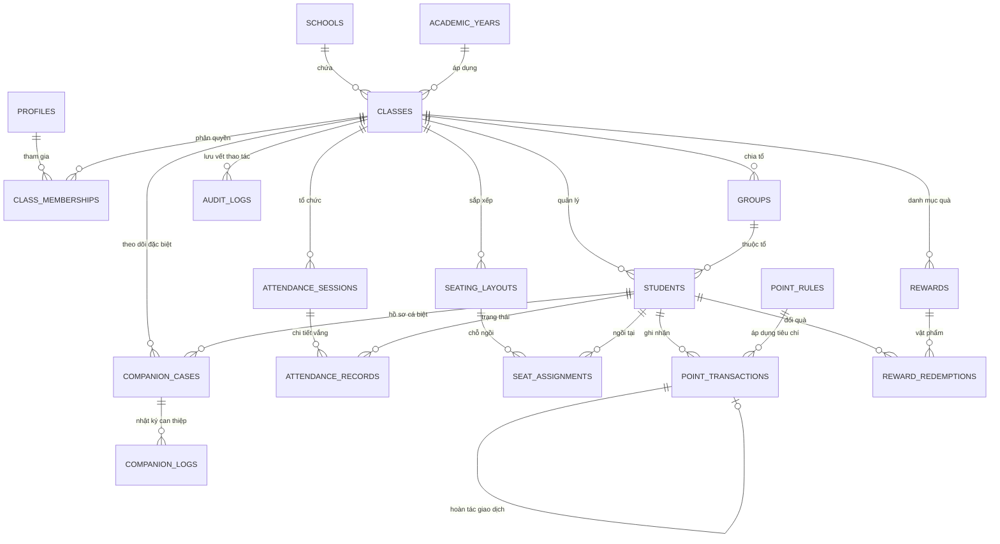

# 🛡️ KIẾN TRÚC DỮ LIỆU & AN TOÀN BẢO MẬT (DATA & SECURITY ARCHITECTURE)
**Dự án:** Web-GVCN (Hệ sinh thái Quản lý Lớp học Giáo viên Chủ nhiệm)  
**Công nghệ:** Supabase PostgreSQL 15+, Supabase Auth, Row Level Security (RLS), Supabase Storage  
**Tác giả:** AI Lead Engineer & Product Architect  
**Ngày ban hành:** 11/09/2026  
**Trạng thái:** DỰ THẢO KIẾN TRÚC – CHỜ CHỦ DỰ ÁN DUYỆT

---

## 1. SƠ ĐỒ THỰC THỂ LIÊN KẾT (ENTITY RELATIONSHIP DIAGRAM - ERD)

Kiến trúc cơ sở dữ liệu được thiết kế theo chuẩn **Multi-tenant sẵn sàng (Hỗ trợ nhiều trường, nhiều lớp, nhiều năm học)** nhưng được tối ưu hóa để MVP chạy trơn tru cho một lớp đơn lẻ mà không bị bó hẹp sau này.



---

## 2. ĐẶC TẢ CHI TIẾT CÁC BẢNG CƠ SỞ DỮ LIỆU CHÍNH (SCHEMA SPECIFICATION)

### 2.1. Phân hệ Tổ chức & Người dùng (Core Identity)
1. **`schools`** (Trường học):  
   `id` (UUID, PK), `name` (VARCHAR), `code` (VARCHAR), `logo_url` (TEXT), `created_at` (TIMESTAMPTZ).
2. **`academic_years`** (Năm học):  
   `id` (UUID, PK), `school_id` (UUID, FK), `name` (VD: '2025-2026'), `start_date` (DATE), `end_date` (DATE), `is_current` (BOOLEAN).
3. **`classes`** (Lớp học):  
   `id` (UUID, PK), `school_id` (UUID, FK), `academic_year_id` (UUID, FK), `name` (VD: '6A6'), `grade` (INT), `room` (VARCHAR), `theme_settings` (JSONB - banner, màu sắc, khẩu hiệu), `created_at` (TIMESTAMPTZ), `deleted_at` (TIMESTAMPTZ - Soft delete).
4. **`profiles`** (Hồ sơ người dùng liên kết với Supabase Auth):  
   `id` (UUID, PK, REFERENCES auth.users.id), `full_name` (VARCHAR), `email` (VARCHAR), `phone` (VARCHAR), `avatar_url` (TEXT), `system_role` (VARCHAR: 'admin', 'teacher', 'student', 'parent').
5. **`class_memberships`** (Phân quyền người dùng trong từng lớp cụ thể):  
   `id` (UUID, PK), `class_id` (UUID, FK), `user_id` (UUID, FK), `class_role` (VARCHAR: 'gvcn', 'bcs', 'bgh', 'member'), `bcs_duty` (VARCHAR: 'Lớp trưởng', 'Phó học tập', 'Phó văn thể', 'Phó lao động', 'Tổ trưởng'), `created_at` (TIMESTAMPTZ).

### 2.2. Phân hệ Học sinh & Tổ thi đua
6. **`groups`** (Tổ trong lớp):  
   `id` (UUID, PK), `class_id` (UUID, FK), `name` (VD: 'Tổ 1', 'Tổ 2'), `color` (VARCHAR), `sort_order` (INT).
7. **`students`** (Học sinh trong lớp):  
   `id` (UUID, PK), `class_id` (UUID, FK), `group_id` (UUID, FK), `full_name` (VARCHAR), `gender` (VARCHAR), `dob` (DATE), `avatar_url` (TEXT), `student_code` (VARCHAR - Mã số học sinh), `pin_code_hash` (VARCHAR - Mã PIN tra cứu an toàn băm bằng bcrypt, không để plaintext 5 số), `role_title` (VARCHAR - Lớp trưởng, Tổ trưởng...), `talent` (TEXT - Năng khiếu), `goal` (TEXT - Mục tiêu), `is_active` (BOOLEAN), `deleted_at` (TIMESTAMPTZ).

### 2.3. Phân hệ Sổ cái Điểm thi đua (Append-Only Point Ledger)
8. **`point_rules`** (Danh mục tiêu chí chấm điểm thi đua):  
   `id` (UUID, PK), `class_id` (UUID, FK), `category` (VARCHAR: 'Học tập', 'Nề nếp', 'Phong trào', 'Đột xuất'), `title` (VARCHAR), `points` (INT - Điểm dương là cộng, điểm âm là trừ), `is_active` (BOOLEAN).
9. **`point_transactions`** (Sổ cái giao dịch điểm - BẤT BIẾN):  
   `id` (UUID, PK), `class_id` (UUID, FK), `student_id` (UUID, FK, Nullable nếu cộng cho cả tổ), `group_id` (UUID, FK, Nullable nếu cộng cho cá nhân), `rule_id` (UUID, FK, Nullable nếu nhập tự do), `points` (INT - Điểm giao dịch), `reason` (TEXT), `category` (VARCHAR), `actor_id` (UUID, FK - Người thực hiện), `actor_role` (VARCHAR: 'gvcn', 'bcs'), `reversal_of_id` (UUID, FK - Trỏ tới giao dịch bị hoàn tác nếu có), `created_at` (TIMESTAMPTZ).  
   *(Quy tắc: Tuyệt đối không xóa bản ghi; Hoàn tác bằng cách INSERT bản ghi ngược dấu trỏ tới `reversal_of_id`)*.

### 2.4. Phân hệ Điểm danh Chuyên cần
10. **`attendance_sessions`** (Phiên điểm danh theo buổi):  
    `id` (UUID, PK), `class_id` (UUID, FK), `session_date` (DATE), `session_type` (VARCHAR: 'morning', 'afternoon'), `taken_by` (UUID, FK), `is_locked` (BOOLEAN - GVCN đã duyệt khóa sổ), `notes` (TEXT), `created_at` (TIMESTAMPTZ).
11. **`attendance_records`** (Bản ghi điểm danh từng học sinh):  
    `id` (UUID, PK), `session_id` (UUID, FK), `student_id` (UUID, FK), `status` (VARCHAR: 'present' [Có mặt], 'late' [Đi trễ], 'excused' [Có phép], 'unexcused' [Không phép], 'truant' [Trốn tiết]), `minutes_late` (INT), `reason` (TEXT), `updated_at` (TIMESTAMPTZ).

### 2.5. Phân hệ Sơ đồ Lớp & Tiện ích Trợ giảng
12. **`seating_layouts`** (Cấu hình sơ đồ lớp):  
    `id` (UUID, PK), `class_id` (UUID, FK), `name` (VARCHAR), `grid_cols` (INT), `grid_rows` (INT), `total_seats` (INT), `is_active` (BOOLEAN).
13. **`seat_assignments`** (Phân bổ chỗ ngồi):  
    `id` (UUID, PK), `layout_id` (UUID, FK), `student_id` (UUID, FK), `seat_code` (VARCHAR - VD: 'seat-12'), `row_index` (INT), `col_index` (INT).
14. **`rewards`** (Danh mục phần thưởng):  
    `id` (UUID, PK), `class_id` (UUID, FK), `name` (VARCHAR), `star_cost` (INT), `icon` (VARCHAR), `color` (VARCHAR), `description` (TEXT), `is_available` (BOOLEAN).
15. **`reward_redemptions`** (Lịch sử đổi quà):  
    `id` (UUID, PK), `student_id` (UUID, FK), `reward_id` (UUID, FK), `status` (VARCHAR: 'pending', 'approved', 'delivered', 'rejected'), `created_at` (TIMESTAMPTZ).

### 2.6. Phân hệ Trạm Đồng Hành (Hồ sơ Bảo mật Tối mật)
16. **`companion_cases`** (Hồ sơ học sinh cần đồng hành đặc biệt):  
    `id` (UUID, PK), `class_id` (UUID, FK), `student_id` (UUID, FK), `start_date` (DATE), `end_date` (DATE, Nullable), `issue_summary` (TEXT - Vấn đề cần khắc phục), `action_plan` (TEXT - Biện pháp giáo dục/đồng hành), `status` (VARCHAR: 'active', 'completed', 'escalated'), `created_by` (UUID, FK - GVCN), `created_at` (TIMESTAMPTZ), `deleted_at` (TIMESTAMPTZ).
17. **`companion_logs`** (Nhật ký tiến trình đồng hành):  
    `id` (UUID, PK), `case_id` (UUID, FK), `log_date` (DATE), `observation` (TEXT - Diễn biến tâm lý/hành vi), `parent_contact` (TEXT - Kết quả trao đổi phụ huynh), `created_by` (UUID, FK), `created_at` (TIMESTAMPTZ).

### 2.7. Phân hệ Vận hành & Nhật ký Kiểm toán
18. **`audit_logs`** (Nhật ký mọi thao tác hệ thống):  
    `id` (UUID, PK), `class_id` (UUID, FK), `actor_id` (UUID, FK), `action_type` (VARCHAR - 'INSERT', 'UPDATE', 'DELETE', 'LOGIN', 'EXPORT'), `entity_name` (VARCHAR), `entity_id` (UUID), `old_data` (JSONB), `new_data` (JSONB), `ip_address` (VARCHAR), `user_agent` (TEXT), `created_at` (TIMESTAMPTZ).

---

## 3. MA TRẬN CHÍNH SÁCH ROW LEVEL SECURITY (RLS POLICY MATRIX)

Mọi bảng trong PostgreSQL đều được kích hoạt: `ALTER TABLE ... ENABLE ROW LEVEL SECURITY;`. Không có ngoại lệ.

```sql
-- Hàm tiện ích kiểm tra vai trò của người dùng trong lớp học hiện tại
CREATE OR REPLACE FUNCTION public.get_user_class_role(target_class_id UUID)
RETURNS VARCHAR AS $$
    SELECT class_role FROM public.class_memberships
    WHERE user_id = auth.uid() AND class_id = target_class_id
    LIMIT 1;
$$ LANGUAGE sql SECURITY DEFINER;
```

| Tên bảng | Thao tác (Operation) | Quyền & Điều kiện kiểm tra RLS (SQL Policy Logic) | Mục đích an toàn |
|:---|:---:|:---|:---|
| **`students`** | `SELECT` | `get_user_class_role(class_id) IN ('gvcn', 'bcs', 'bgh')` | Cán sự, GVCN và BGH xem được danh sách học sinh của lớp |
| **`students`** | `INSERT / UPDATE / DELETE` | `get_user_class_role(class_id) = 'gvcn'` | **Chỉ duy nhất GVCN** được thêm, sửa thông tin, xóa học sinh |
| **`point_transactions`** | `SELECT` | `get_user_class_role(class_id) IN ('gvcn', 'bcs', 'bgh')` | Minh bạch lịch sử thi đua trong nội bộ lớp |
| **`point_transactions`** | `INSERT` | `get_user_class_role(class_id) IN ('gvcn', 'bcs')` | Cả GVCN và Ban cán sự đều được quyền chấm điểm theo tiêu chí |
| **`point_transactions`** | `UPDATE / DELETE` | `USING (false)` | **NGHIÊM CẤM UPDATE/DELETE TRỰC TIẾP** (Bảo vệ sổ cái bất biến) |
| **`attendance_records`** | `INSERT / UPDATE` | `get_user_class_role(class_id) = 'gvcn' OR (get_user_class_role(class_id) = 'bcs' AND EXISTS (SELECT 1 FROM attendance_sessions s WHERE s.id = session_id AND s.is_locked = false AND s.session_date = CURRENT_DATE))` | Cán sự chỉ được điểm danh trong ngày khi chưa bị GVCN khóa sổ |
| **`companion_cases`** | `SELECT / INSERT / UPDATE / DELETE` | `get_user_class_role(class_id) = 'gvcn'` | **TUYỆT ĐỐI CHỈ GVCN ĐƯỢC PHÉP TRUY CẬP** (Chặn hoàn toàn BCS và Học sinh) |
| **`companion_logs`** | `SELECT / INSERT / UPDATE / DELETE` | `get_user_class_role((SELECT class_id FROM companion_cases c WHERE c.id = case_id)) = 'gvcn'` | Bảo vệ nhật ký tiến trình đồng hành nhạy cảm |
| **`audit_logs`** | `SELECT` | `get_user_class_role(class_id) IN ('gvcn', 'bgh')` | Chỉ GVCN và Giám hiệu xem được nhật ký kiểm toán |

---

## 4. THIẾT KẾ SUPABASE STORAGE BUCKETS

Để chấm dứt hoàn toàn tình trạng chuyển ảnh sang Base64 gây tràn hạn mức `localStorage`, hệ thống tổ chức 4 Storage Buckets chuyên biệt:

| Tên Bucket | Trạng thái (Public / Private) | Kích thước tối đa | Định dạng cho phép | Chính sách truy cập (Storage RLS) |
|:---|:---:|:---:|:---:|:---|
| **`avatars`** | Public (Đọc công khai qua CDN) | 2 MB | `image/jpeg`, `image/png`, `image/webp` | Upload: Chỉ GVCN hoặc chính chủ học sinh. Đọc: Mọi người trong trường. |
| **`banners`** | Public | 5 MB | `image/jpeg`, `image/png`, `image/webp` | Upload: Chỉ GVCN lớp đó. Đọc: Công khai. |
| **`companion_attachments`** | **Strictly PRIVATE (Tối mật)** | 10 MB | `image/*`, `application/pdf` | **Chỉ GVCN lớp mới có quyền đọc thông qua Presigned URL (hết hạn sau 5 phút)**. Tuyệt đối không public link. |
| **`backups`** | Strictly PRIVATE | 25 MB | `application/json`, `application/zip` | Chỉ GVCN và Quản trị viên hệ thống. |

---

## 5. CƠ CHẾ BẢO VỆ DỮ LIỆU TRẠM ĐỒNG HÀNH (SPECIAL COMPANION PRIVACY)

1. **Cô lập dữ liệu mức bảng:** Tách biệt hoàn toàn bảng `companion_cases` khỏi hồ sơ học sinh thông thường. Không gộp chung trường vi phạm vào bảng `students`.
2. **Ngăn chặn rò rỉ API:** Do có chính sách RLS chặn ở mức DB, ngay cả khi người dùng can thiệp vào mã nguồn JavaScript hoặc gọi trực tiếp Supabase REST API, PostgreSQL sẽ trả về mảng rỗng `[]` hoặc lỗi `403 Forbidden`.
3. **Audit Log chuyên sâu:** Mỗi lần GVCN xem, thêm hoặc chỉnh sửa hồ sơ Trạm Đồng Hành, hệ thống tự động ghi nhật ký vào `audit_logs` kèm địa chỉ IP và thời gian để đảm bảo trách nhiệm giải trình.

---

## 6. CHIẾN LƯỢC SAO LƯU, PHỤC HỒI & XÓA MỀM (BACKUP & RETENTION)

- **Xóa mềm (Soft Delete):** Mọi bảng dữ liệu quan trọng (`students`, `classes`, `companion_cases`) đều có cột `deleted_at`. Khi người dùng bấm xóa trên UI, hệ thống chỉ cập nhật `deleted_at = NOW()`. Dữ liệu vẫn được giữ trong DB để có thể khôi phục khi bấm nhầm.
- **Sao lưu tự động (Automated Backups):** Supabase Point-in-Time Recovery (PITR) sao lưu tự động hàng ngày.
- **Xuất bản sao lưu độc lập (Self-Hosted Backup):** GVCN có thể bấm nút "Tải bản sao lưu JSON" bất kỳ lúc nào để lưu trữ về máy tính cá nhân. Bản JSON này được mã hóa và ký số (HMAC) để chống can thiệp sửa đổi trái phép khi phục hồi.

---

## 7. BẢNG KIỂM AN TOÀN THEO CHUẨN OWASP TOP 10 (OWASP COMPLIANCE)

| Mã lỗi OWASP | Rủi ro tiềm ẩn | Biện pháp khắc phục trong Kiến trúc mới Web-GVCN |
|:---|:---|:---|
| **A01: Broken Access Control** | Người dùng xem trộm dữ liệu lớp khác hoặc vượt quyền | 100% bảo vệ bằng PostgreSQL Row Level Security (RLS); Frontend kiểm tra quyền qua React Router Guards. |
| **A02: Cryptographic Failures** | Lộ mật khẩu hard-code trong code | Loại bỏ hoàn toàn mật khẩu hard-code; sử dụng Supabase Auth với cơ chế mã hóa mật khẩu Argon2/bcrypt chuẩn quốc tế. |
| **A03: Injection (SQLi & XSS)** | Chèn mã độc qua tên học sinh hoặc file Excel | Dùng tham số hóa truy vấn (Parameterized queries) qua Supabase SDK; React JSX tự động escape mã độc HTML; xác thực dữ liệu đầu vào nghiêm ngặt bằng **Zod Schema**. |
| **A04: Insecure Design** | Điểm số bị sửa đổi tùy tiện không lưu vết | Chuyển đổi sang kiến trúc Sổ cái bất biến (Append-Only Point Ledger); hoàn tác qua giao dịch đảo. |
| **A07: Identification Failures** | Dò quét mã tra cứu phụ huynh 5 chữ số | Thay thế mã 5 số ngẫu nhiên bằng cơ chế Mã học sinh + Mã PIN bảo mật băm mật mã, tích hợp cơ chế chống dò quét (Rate-limiting tối đa 5 lần thử/phút). |

---
*Tài liệu này xác lập tiêu chuẩn an toàn dữ liệu cao nhất cho hệ thống Web-GVCN. Tiếp theo là Kế hoạch Chuyển đổi Dữ liệu & Triển khai tại `docs/04-migration-and-delivery-plan.md`.*
