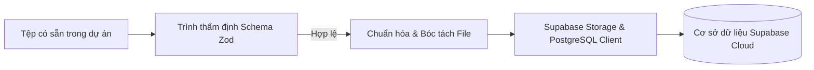
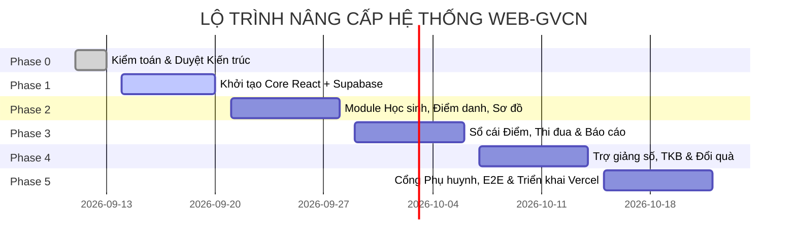

# 🚀 KẾ HOẠCH CHUYỂN ĐỔI DỮ LIỆU & LỘ TRÌNH TRIỂN KHAI (MIGRATION & DELIVERY PLAN)
**Dự án:** Web-GVCN (Nâng cấp từ Prototype lên Ứng dụng Quản lý Lớp học Chuyên nghiệp)  
**Lộ trình công nghệ:** Antigravity (Local) → Supabase (Database & Auth) → GitHub (Version Control) → Vercel (Edge Deployment)  
**Tác giả:** AI Lead Engineer & Product Architect  
**Ngày ban hành:** 11/09/2026  
**Trạng thái:** DỰ THẢO KIẾN TRÚC – CHỜ CHỦ DỰ ÁN DUYỆT

---

## 1. BẢN ĐỒ ÁNH XẠ DỮ LIỆU CŨ SANG HỆ THỐNG MỚI (DATA MAPPING MATRIX)

Bảng ánh xạ chi tiết chuyển đổi từ đối tượng `state` trong `localStorage` (`classManagerData`) sang các bảng quan hệ trên Supabase PostgreSQL:

| Dữ liệu cũ trong State / localStorage | Bảng đích mới trên Supabase | Kiểu dữ liệu & Quy tắc chuyển đổi | Xử lý ngoại lệ & Làm sạch dữ liệu |
|:---|:---|:---|:---|
| `state.students[]` | Bảng `students` | `id` (chuyển sang UUID), `name` → `full_name`, `group` → ánh xạ sang `group_id`, `avatarUrl` | Tách ảnh Base64 tải lên Storage bucket `avatars`, lưu URL CDN; băm mã tra cứu `code` thành `pin_code_hash`. |
| `state.groups[]` | Bảng `groups` | `name` (Tổ 1, 2, 3, 4), `color`, `avatarUrl` | Chuẩn hóa màu sắc Tailwind sang mã màu HEX nhất quán. |
| `student.history[]` | Bảng `point_transactions` | Tách từng phần tử lịch sử thành 1 bản ghi giao dịch; lưu `points`, `reason`, `category`, `time` | Chuyển chuỗi ngày giờ text cũ sang định dạng `TIMESTAMPTZ` chuẩn ISO 8601; gán `actor_role = 'gvcn'`. |
| `state.attendanceRecords{}` | Bảng `attendance_sessions` và `attendance_records` | Chuyển khóa ngày `YYYY-MM-DD` thành phiên điểm danh; các trạng thái vắng thành bản ghi học sinh | Chuyển đổi ký hiệu: `P` → `excused`, `KP` → `unexcused`, `T` → `late`, mặc định không có trong object là `present`. |
| `state.seatingChart{}`, `state.gridCols` | Bảng `seating_layouts` và `seat_assignments` | Khóa `seat-X: studentId` chuyển thành tọa độ hàng (`row_index`) và cột (`col_index`) | Tự động tính toán lại ma trận chỗ ngồi chuẩn hóa theo lưới ma trận thay vì chuỗi tùy biến. |
| `state.rewards[]` | Bảng `rewards` | `name`, `cost` → `star_cost`, `icon`, `color`, `desc` | Giữ nguyên 4 phần thưởng mặc định hấp dẫn của lớp học. |
| `state.companions[]` | Bảng `companion_cases` | `studentId`, `startDate`, `issue` → `issue_summary`, `measures` → `action_plan` | **MÃ HÓA VÀ KÍCH HOẠT RLS TỐI MẬT:** Tuyệt đối không để sót trong client cache. |
| `state.theme`, `state.admin` | Bảng `classes` & `profiles` | Tên lớp, chức vụ giáo viên, ảnh đại diện, banner lớp | Bóc tách ảnh banner Base64 đẩy lên bucket `banners`. |

---

## 2. QUY TRÌNH NHẬP DỮ LIỆU CÓ SẴN TRONG THƯ MỤC DỰ ÁN (DATA INGESTION PIPELINE)

Thư mục dự án đã có sẵn các tệp dữ liệu thực tế rất giá trị của lớp 6A6. Quy trình nhập liệu sẽ tự động hóa qua các kịch bản chuyển đổi:

1. **Nhập danh sách học sinh từ `danh-sach-hs-6a6.xlsx` và file mẫu:**
   - Đọc tự động các cột: *STT, Họ và tên, Giới tính, Ngày sinh, Tổ, Chức vụ, Năng khiếu*.
   - Tự động chuẩn hóa Họ tên tiếng Việt (viết hoa chữ cái đầu, loại bỏ khoảng trắng thừa).
   - Tự động sinh mã học sinh duy nhất và mã PIN bảo mật ngẫu nhiên.
2. **Nhập thời khóa biểu từ `TKB-LOP-6A6.xlsx`:**
   - Tự động trích xuất các buổi học sáng/chiều từ Thứ Hai đến Thứ Bảy, phân định rõ số tiết và tên môn học.
3. **Nạp 40 tiêu chí thi đua từ `TIEU-CHI-CHAM-DIEM-THI-DUA-GIUA-CAC-TO.md`:**
   - Tự động nạp vào bảng `point_rules` với 8 tiêu chí điểm cộng và 32 tiêu chí điểm trừ đúng chuẩn năm học 2025–2026.
4. **Nạp phân công Ban Cán Sự từ `BAN-CAN-SU-LOP/BAN-CAN-SU-LOP-6A6.md`:**
   - Thiết lập vai trò tự quản cho 12 thành viên: Lớp trưởng, Phó học tập, Phó văn thể, Phó lao động và 4 Tổ trưởng, 4 Tổ phó.

---

## 3. LỘ TRÌNH PHÁT TRIỂN & TRIỂN KHAI 5 GIAI ĐOẠN (DELIVERY ROADMAP)

### 📌 Giai đoạn 0: Thiết kế Kiến trúc & Phê duyệt (HIỆN TẠI)
- **Công việc:** Kiểm toán mã nguồn, lập PRD, RBAC, Database Schema, Migration Plan, Test Matrix.
- **Quy tắc:** Đóng băng mã nguồn, không sửa `index.html`, chờ chủ dự án phê duyệt.

### 📌 Giai đoạn 1: Nền tảng Hệ thống & Cơ sở Dữ liệu (Foundation)
- **Công việc:**
  - Khởi tạo dự án Vite + React 18+ + TypeScript + Tailwind CSS (cài qua npm, loại bỏ hoàn toàn CDN).
  - Cấu hình Supabase Client, Auth Provider, React Router với Route Guards.
  - Chạy migration SQL tạo toàn bộ bảng, kích hoạt RLS policies và tạo Storage buckets.
- **Tiêu chí hoàn thành:** Đăng nhập an toàn bằng tài khoản GVCN thật, phân quyền chính xác.

### 📌 Giai đoạn 2: Quản lý Học sinh, Chuyên cần & Trạm Đồng Hành
- **Công việc:**
  - Giao diện danh sách học sinh, modal thêm/sửa, import Excel bằng SheetJS cục bộ.
  - Phân hệ Điểm danh buổi sáng/chiều với giao diện tối ưu trên điện thoại.
  - Sơ đồ lớp tương tác kéo thả mượt mà, sửa lỗi nút "Thu hồi".
  - Phân hệ Trạm Đồng Hành bảo mật riêng tư tuyệt đối cho GVCN.
- **Tiêu chí hoàn thành:** Dữ liệu học sinh và điểm danh đồng bộ tức thì giữa PC và điện thoại.

### 📌 Giai đoạn 3: Sổ cái Điểm thi đua & Thống kê Báo cáo
- **Công việc:**
  - Xây dựng form tích điểm theo 40 tiêu chí chuẩn.
  - Cơ chế Sổ cái bất biến (Append-Only) và luồng Hoàn tác giao dịch đối ứng.
  - Bảng xếp hạng tổ thi đua tính từ giao dịch thật (loại bỏ hoàn toàn `Math.sin`).
  - Xuất báo cáo tuần/tháng ra PDF và Excel chuẩn mẫu in.
- **Tiêu chí hoàn thành:** 100% số liệu tính toán chính xác, có thể đối soát minh bạch từng điểm số.

### 📌 Giai đoạn 4: Trợ giảng số & Tiện ích Lớp học
- **Công việc:**
  - Đồng hồ đếm ngược có chuông báo (Tone.js nạp qua npm, sửa các hàm trùng lặp).
  - Vòng quay gọi tên học sinh ngẫu nhiên kèm hiệu ứng pháo hoa Canvas.
  - Lịch báo giảng theo tiết và Thời khóa biểu tương tác.
  - Danh mục đổi quà bằng ngôi sao tích lũy.

### 📌 Giai đoạn 5: Cổng Phụ huynh, Kiểm thử Toàn diện & Triển khai Production
- **Công việc:**
  - Cổng tra cứu riêng tư cho Phụ huynh (có Rate-limit chống brute-force).
  - Kiểm thử tự động: Unit test với Vitest, Kiểm thử E2E với Playwright.
  - Thiết lập kho lưu trữ GitHub và cấu hình Vercel Deployment tự động.

---

## 4. CHIẾN LƯỢC HOÀN TÁC & BẢO VỆ DỰ PHÒNG (ROLLBACK STRATEGY)

Để đảm bảo công tác giảng dạy của Thầy/Cô không bao giờ bị gián đoạn:
1. **Bảo tồn nguyên vẹn `index.html`:** Tệp nguyên mẫu cũ luôn được giữ nguyên trong thư mục gốc làm bản dự phòng ngoại tuyến (Offline Fallback). Khi cần trình diễn ngay hoặc khi chưa có mạng, giáo viên vẫn có thể mở trực tiếp trên trình duyệt.
2. **Quản lý mã nguồn theo nhánh Git:**
   - Nhánh `main`: Chỉ chứa mã nguồn đã kiểm thử đạt 100% tiêu chí nghiệm thu.
   - Nhánh `develop`: Nhánh tích hợp các tính năng mới.
   - Nhánh `feature/*`: Từng tính năng phát triển độc lập theo nguyên tắc kiến trúc 14 điểm.
3. **Vercel Instant Rollback:** Nếu phiên bản mới triển khai trên Vercel gặp lỗi bất ngờ, hệ thống cho phép quay về phiên bản trước đó (Rollback) chỉ với 1 cú click chuột trong vòng **30 giây**.

---

## 5. BẢNG KIỂM TRIỂN KHAI GITHUB & VERCEL (DEPLOYMENT CHECKLIST)

### 5.1. Cấu hình Biến Môi trường (Environment Variables)
- [ ] Tạo tệp `.env.example` chứa danh sách biến mẫu.
- [ ] Cấu hình `VITE_SUPABASE_URL` trên Vercel Dashboard.
- [ ] Cấu hình `VITE_SUPABASE_ANON_KEY` trên Vercel Dashboard.
- [ ] **BẮT BUỘC:** Tuyệt đối **KHÔNG** đưa `SUPABASE_SERVICE_ROLE_KEY` vào frontend hoặc tệp `.env` đẩy lên GitHub.
- [ ] Thêm `.env`, `.env.local`, `node_modules`, `dist` vào `.gitignore`.

### 5.2. Cấu hình An toàn Tiêu đề HTTP (Security Headers trên Vercel)
Cấu hình trong tệp `vercel.json`:
- [ ] `Content-Security-Policy` (CSP): Giới hạn nguồn kết nối API chỉ tới domain Supabase của dự án.
- [ ] `X-Frame-Options: DENY`: Chống tấn công Clickjacking chèn trang vào iframe lạ.
- [ ] `X-Content-Type-Options: nosniff`: Chống mạo danh kiểu dữ liệu MIME.
- [ ] `Strict-Transport-Security` (HSTS): Ép buộc sử dụng HTTPS toàn diện.

---
*Kế hoạch này vạch rõ từng bước đi vững chắc, bảo vệ tuyệt đối dữ liệu giáo viên trong suốt quá trình chuyển đổi. Tiếp theo là Ma trận Kiểm thử Nghiệm thu tại `docs/05-acceptance-test-matrix.md`.*
