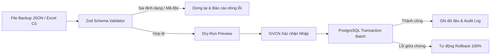

# KẾ HOẠCH DI CHUYỂN DỮ LIỆU & LỘ TRÌNH TRIỂN KHAI (MIGRATION & DELIVERY PLAN)
**Dự án:** Hệ thống Quản trị Lớp học Web-GVCN (Bản Production)  
**Tác giả:** AI Lead Engineer & Product Architect  
**Trạng thái:** Chờ chủ dự án duyệt kiến trúc  

---

## 1. ÁNH XẠ CẤU TRÚC DỮ LIỆU TỪ NGUYÊN MẪU SANG POSTGRESQL (DATA MAPPING)

| Nguồn trong `Index.html` (`state` / LocalStorage) | Đích trong Supabase / PostgreSQL | Phương thức chuyển đổi & Quy tắc làm sạch |
|---|---|---|
| `state.students[]` | Bảng `students` | Sinh UUID mới cho mỗi học sinh; chuyển đổi `group: "Tổ 1"` thành `group_id` tương ứng; loại bỏ Base64 avatar. |
| `student.history[]` | Bảng `point_transactions` | Mỗi phần tử lịch sử được tạo thành 1 dòng transaction; chuyển đổi chuỗi ngày giờ sang `TIMESTAMPTZ` (UTC/Asia_Ho_Chi_Minh); gán `created_by` là GVCN. |
| `state.groups[]` | Bảng `groups` | Ánh xạ 4 tổ mặc định (`g1`, `g2`, `g3`, `g4`) sang UUID, giữ nguyên tên tổ và mã màu. |
| `state.attendanceRecords[date][studentId]` | Bảng `attendance_sessions` + `attendance_records` | Gom nhóm theo `date` tạo session; mỗi cặp `(session_id, student_id)` tạo một bản ghi chi tiết với trạng thái (`present`, `late`, `excused`, `unexcused`). |
| `state.rewards[]` | Bảng `rewards` | Ánh xạ danh mục quà, giá sao, số lượng tồn kho. |
| `state.companions[]` | Bảng `companion_cases` + `companion_updates` | Tách trường `issue` (vấn đề) và `measures` (biện pháp) vào bảng ca hỗ trợ; đặt trạng thái ban đầu là `status: 'active'`. |
| `state.tasks[]` | Bảng `tasks` | Chuyển đổi checklist nhiệm vụ lớp. |
| `state.journeys[]` | Bảng `class_milestones` | Chuyển đổi các sự kiện, hành trình kỷ niệm của lớp. |
| `state.theme`, `state.admin`, `state.settings` | Bảng `classes` + `class_settings` | Chuyển bannerUrl, tên lớp, chủ điểm tháng, thiết lập trừ sao vào cột JSONB `theme_config` và `settings`. |
| `state.auth` & Mật khẩu tĩnh | **BỎ HOÀN TOÀN** | Không chuyển đổi mật khẩu hard-coded hay trạng thái `loggedIn` giả; thay thế 100% bằng Supabase Auth. |

---

## 2. CÔNG CỤ NHẬP SAO LƯU JSON VÀ EXCEL AN TOÀN (SAFE IMPORT ENGINE)



### 2.1. Quy trình 5 bước nhập dữ liệu cũ (Legacy Migration Pipeline)
1. **Phát hiện phiên bản (Version Sniffing):** Nhận diện cấu trúc backup JSON cũ (chứa khóa `chuyen_tau_data` hoặc các trường `students`, `attendanceRecords`).
2. **Xác thực dữ liệu nghiêm ngặt (Zod Schema Validation):** Kiểm tra từng đối tượng; loại bỏ mọi thẻ HTML độc hại hoặc payload XSS (Sanitize string); kiểm tra tính hợp lệ của ngày tháng.
3. **Mô phỏng thử nghiệm (Dry-Run Preview):** Hiển thị màn hình tóm tắt trước khi ghi:
   - Tổng số học sinh tìm thấy: vd $45$ em.
   - Tổng số giao dịch điểm thi đua: vd $320$ lượt.
   - Tổng số ngày điểm danh: vd $18$ ngày.
   - Cảnh báo các bản ghi thiếu thông tin (nếu có).
4. **Thực thi giao dịch an toàn (Atomic Transaction Batch):** Toàn bộ dữ liệu được ghi vào cơ sở dữ liệu bên trong một khối Transaction (`BEGIN ... COMMIT`). Nếu có bất kỳ lỗi nào xảy ra ở bất kỳ dòng nào, toàn bộ quá trình được hoàn tác tự động (`ROLLBACK`), không để lại dữ liệu rác.
5. **Chuyển đổi hình ảnh (Asset Relocation):** Các chuỗi ảnh Base64 hợp lệ trong JSON được giải mã, kiểm tra MIME type an toàn (JPEG/PNG/WebP), tải lên Supabase Storage bucket và cập nhật lại URL công khai/signed URL vào database.

---

## 3. LỘ TRÌNH TRIỂN KHAI THEO GIAI ĐOẠN (PHASED DELIVERY ROADMAP)

```mermaid
gantt
    title Kế hoạch Triển khai Chi tiết Web-GVCN Production
    dateFormat  YYYY-MM-DD
    section Giai đoạn Khởi tạo & Dữ liệu
    Phase 1: Nền tảng React+TS+Vite & Legacy Backup :2026-09-01, 3d
    Phase 2: Database Schema, Migration & RLS        :2026-09-04, 3d
    Phase 3: Supabase Auth & RBAC Guard             :2026-09-07, 3d
    section Giai đoạn Nghiệp vụ Chính
    Phase 4: Quản lý Lớp, Học sinh & Import Excel   :2026-09-10, 4d
    Phase 5: Điểm danh, Point Ledger & Báo cáo      :2026-09-14, 4d
    Phase 6: Cổng Phụ huynh & Bảo mật Trạm ĐH       :2026-09-18, 4d
    section Giai đoạn Tiện ích & Bàn giao
    Phase 7: Sơ đồ lớp, TKB, Lịch báo giảng, Tools  :2026-09-22, 4d
    Phase 8: Công cụ Di chuyển dữ liệu cũ (JSON)    :2026-09-26, 3d
    Phase 9: QA Kiểm thử toàn diện & Deploy Vercel  :2026-09-29, 3d
```

- **Phase 1 – Nền tảng & Bảo toàn:** Lưu trữ bản gốc `Index.html` vào thư mục `legacy/`. Khởi tạo project React + TypeScript + Vite + Tailwind npm + Vitest + Playwright.
- **Phase 2 – Hạ tầng Dữ liệu:** Tạo thư mục `supabase/migrations`, triển khai 21 bảng dữ liệu, cấu hình RLS và Storage buckets.
- **Phase 3 – Xác thực & Phân quyền:** Tích hợp Supabase Auth, xây dựng `ProtectedRoute` và hệ thống Menu/Routing phân vai 6 cấp.
- **Phase 4 – Dữ liệu Nền tảng:** Màn hình quản lý Học sinh, Tổ, cấu hình Theme lớp, chức năng nhập Excel trực quan.
- **Phase 5 – Nghiệp vụ Cốt lõi:** Điểm danh theo ngày, Sổ cái cộng/trừ điểm Append-only, Shop đổi sao, Báo cáo tuần/tháng/kỳ (số liệu thật).
- **Phase 6 – Cổng Liên kết & An toàn Dữ liệu:** Cổng phụ huynh tra cứu con qua mã mời bảo mật, Hồ sơ Trạm đồng hành bảo mật tuyệt đối.
- **Phase 7 – Phục hồi Công cụ Tiết học:** Sơ đồ chỗ ngồi kéo thả, Thời khóa biểu, Lịch báo giảng hợp nhất, Vòng quay ngẫu nhiên, Đồng hồ, Chuông Tone.js.
- **Phase 8 – Công cụ Migration:** Giao diện Import backup JSON cũ dành cho GVCN đang sử dụng bản prototype muốn chuyển dữ liệu sang hệ thống mới.
- **Phase 9 – Kiểm thử & Phát hành:** Chạy toàn bộ test suites, kiểm tra bảo mật, tối ưu Core Web Vitals và triển khai lên Vercel.

---

## 4. KẾ HOẠCH DỰ PHÒNG & KHÔI PHỤC KHI CÓ SỰ CỐ (ROLLBACK PLAN)

1. **Bảo toàn Bản tham chiếu (Legacy Protection):**
   - Tệp `Index.html` và bản mã dự phòng được giữ nguyên trạng thái trong thư mục `legacy/`. Không bao giờ ghi đè hoặc can thiệp trực tiếp vào tệp này.
2. **Rollback ở Tầng Cơ sở dữ liệu (Database Rollback):**
   - Mỗi file migration `supabase/migrations/{timestamp}_{name}.sql` đều đi kèm đoạn mã hạ cấp (Down Migration). Khi gặp sự cố schema, chạy lệnh `supabase db reset` hoặc rollback về migration trước đó.
3. **Rollback ở Tầng Triển khai Ứng dụng (Vercel Instant Rollback):**
   - Nhờ tích hợp GitHub + Vercel, mỗi lần push mã lên nhánh `main` tạo ra một Instant Deployment. Nếu bản phát hành mới gặp lỗi nghiêm trọng, chỉ cần 1 click trên Vercel Dashboard để Rollback về phiên bản ổn định trước đó trong vòng 5 giây.

---

## 5. CHECKLIST TRIỂN KHAI GITHUB & VERCEL (DEPLOYMENT CHECKLIST)

### 5.1. Cấu hình Biến Môi trường (Environment Variables)
- [ ] `VITE_SUPABASE_URL`: Đường dẫn API dự án Supabase.
- [ ] `VITE_SUPABASE_ANON_KEY`: Khóa công khai an toàn (chỉ hoạt động với RLS).
- [ ] **TUYỆT ĐỐI KHÔNG cấu hình** `SUPABASE_SERVICE_ROLE_KEY` trong môi trường Vercel Frontend hoặc file `.env.local` của client.

### 5.2. Cấu hình Tối ưu Hóa Vercel & Vite
- [ ] Cấu hình `vercel.json` định tuyến SPA (`rewrites: [{ "source": "/(.*)", "destination": "/index.html" }]`) để tránh lỗi 404 khi người dùng tải lại trang con.
- [ ] Tối ưu hóa phân tách gói mã (Code Splitting / Lazy Loading) qua Vite cho các module nặng như SheetJS (`xlsx`), Tone.js, html2pdf.
- [ ] Bật chế độ nén Gzip / Brotli và cache tài sản tĩnh (Static Assets Caching Headers).
