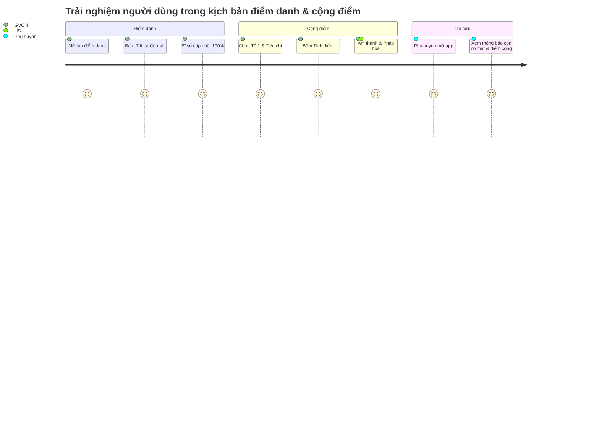

# MA TRẬN KIỂM THỬ NGHIỆM THU (ACCEPTANCE TEST MATRIX)
**Dự án:** Hệ thống Quản trị Lớp học Web-GVCN (Bản Production)  
**Tác giả:** AI Lead Engineer & QA Specialist  
**Trạng thái:** Chờ chủ dự án duyệt kiến trúc  

---

## 1. MA TRẬN KIỂM THỬ THEO VAI TRÒ NGƯỜI DÙNG (ROLE-BASED TEST MATRIX)

| Mã kiểm thử | Vai trò thực hiện | Hành động kiểm thử | Kết quả mong đợi (Expected Outcome) | Trạng thái |
|---|---|---|---|---|
| **TEST-ROLE-01** | Khách vãng lai (Chưa Auth) | Cố tình truy cập URL `/dashboard` hoặc `/students` | Bị chặn ngay tại `ProtectedRoute`, tự động chuyển hướng về `/login`. | Thiết kế sẵn |
| **TEST-ROLE-02** | GVCN | Đăng nhập tài khoản GVCN đã được phân công Lớp 12A1 | Truy cập đầy đủ 11 tính năng: Học sinh, Tích điểm, Điểm danh, Trạm đồng hành, Sơ đồ, Báo cáo, Cài đặt. | Thiết kế sẵn |
| **TEST-ROLE-03** | Ban Cán Sự (BCS) | Đăng nhập tài khoản BCS Lớp 12A1 | Chỉ thấy các menu được cấp quyền; menu "Trạm đồng hành" và "Cài đặt nâng cao" bị ẩn hoàn toàn. | Thiết kế sẵn |
| **TEST-ROLE-04** | BCS | Thử gọi API đọc `companion_cases` qua lệnh console hoặc Postman | Nhận mã lỗi `403 Forbidden` hoặc mảng rỗng `[]` từ Supabase RLS. | Thiết kế sẵn |
| **TEST-ROLE-05** | Ban Giám Hiệu (BGH) | Đăng nhập tài khoản BGH | Xem được báo cáo và sơ đồ các lớp thuộc trường; không có nút "Sửa học sinh", "Xóa điểm" hay "Đổi quà". | Thiết kế sẵn |
| **TEST-ROLE-06** | Phụ huynh A | Truy cập xem bảng điểm bằng tài khoản đã liên kết với Học sinh A | Chỉ hiển thị kết quả của Học sinh A; không hiển thị danh sách hay điểm của Học sinh B. | Thiết kế sẵn |
| **TEST-ROLE-07** | GVCN Lớp A | Cố tình gửi request sửa thông tin học sinh thuộc Lớp B | Supabase RLS chặn với lỗi vi phạm chính sách bảo mật (Policy Violation). | Thiết kế sẵn |

---

## 2. KIỂM THỬ BẢO MẬT & TÍNH TOÀN VẸN DỮ LIỆU (SECURITY & DATA INTEGRITY)

### 2.1. Kiểm thử XSS (Cross-Site Scripting Injection)
- **Kịch bản:** Tải lên file Excel chứa tên học sinh: `` hoặc ``.
- **Kỳ vọng:** React escape tự động chuỗi ký tự; dữ liệu hiển thị dạng văn bản thuần trên giao diện, không có bất kỳ mã JavaScript nào được thực thi trong trình duyệt.

### 2.2. Kiểm thử Tính toàn vẹn Sổ cái Điểm (Append-Only Math Verification)
- **Kịch bản:**
  1. Học sinh có $0$ sao ban đầu.
  2. Cộng $+10$ sao (Lý do: "Phát biểu hay"). Sổ cái ghi nhận dòng #1 ($+10$). Tổng số dư $= 10$.
  3. Đổi quà tiêu tốn $-6$ sao. Sổ cái ghi nhận dòng #2 ($-6$). Tổng số dư $= 4$.
  4. GVCN phát hiện dòng #1 nhập nhầm và bấm "Hoàn tác".
  5. Hệ thống ghi nhận dòng #3 ($-10$, `reversal_of_id: #1`).
- **Kỳ vọng:**
  - Bản ghi gốc #1 không bị xóa khỏi cơ sở dữ liệu.
  - Tổng số dư được tính lại: $10 - 6 - 10 = -2$ sao (hoặc hệ thống cảnh báo không đủ số dư để hoàn tác nếu số dư không âm).
  - Lịch sử hiển thị minh bạch toàn bộ 3 dòng giao dịch kèm người thực hiện và ngày giờ.

### 2.3. Kiểm thử Bảo mật Cổng Tra cứu Phụ huynh (Brute-force Resistance)
- **Kịch bản:** Kẻ xấu dùng script tự động gửi $10.000$ mã token ngẫu nhiên trong 1 phút để dò quét thông tin học sinh.
- **Kỳ vọng:**
  - Sau 5 lần nhập sai liên tiếp, hệ thống kích hoạt Rate-limit (khóa tạm 15 phút hoặc yêu cầu giải Captcha).
  - Token liên kết có độ dài 32 ký tự ngẫu nhiên (UUIDv4 / Cryptographic string), xác suất đoán trúng là $1 / 2^{128}$ (bất khả thi về mặt toán học).

---

## 3. KỊCH BẢN KIỂM THỬ TRỌNG YẾU (GIVEN – WHEN – THEN SCENARIOS)

### Kịch bản 1: Đăng nhập và phân quyền truy cập
- **GIVEN:** Người dùng là Giáo viên Chủ nhiệm Lớp 12A1 đã có tài khoản trên hệ thống.
- **WHEN:** Giáo viên nhập đúng Email và Mật khẩu trên màn hình đăng nhập rồi bấm "Đăng nhập".
- **THEN:**
  - Hệ thống xác thực thành công qua Supabase Auth.
  - Ứng dụng tải cấu hình Lớp 12A1 (Banner, Màu sắc, Slogan).
  - Thanh Sidebar hiển thị đầy đủ các phân hệ quản trị.

### Kịch bản 2: Nhập danh sách lớp từ file Excel
- **GIVEN:** GVCN đang ở màn hình Quản lý Học sinh và có file `Danh_sach_12A1.xlsx` (45 học sinh, có đủ cột Họ tên, Giới tính, Ngày sinh, Tổ).
- **WHEN:** GVCN kéo thả file vào khung nhập và bấm "Kiểm tra dữ liệu".
- **THEN:**
  - Bảng xem trước (Preview) hiển thị 45 dòng màu xanh (Hợp lệ).
  - Khi bấm "Lưu vào hệ thống", 45 học sinh được tạo mới trong cơ sở dữ liệu.
  - Danh sách học sinh và 4 tổ thi đua được cập nhật tức thì trên giao diện mà không cần tải lại trang.

### Kịch bản 3: Điểm danh chuyên cần nhanh
- **GIVEN:** Lớp 12A1 có 45 học sinh, đầu giờ học sáng thứ Hai.
- **WHEN:** GVCN mở Tab Điểm danh và bấm nút "Tất cả có mặt".
- **THEN:**
  - Toàn bộ 45 thẻ học sinh chuyển sang trạng thái "Có mặt" (Màu xanh).
  - Thanh thống kê trên Header hiển thị: "Hiện diện: 45/45 (100%)".
  - Một phiên điểm danh mới (`attendance_session`) được ghi vào Supabase với dấu thời gian thực.

### Kịch bản 4: Ghi nhận điểm thi đua và Đổi quà
- **GIVEN:** Học sinh "Nguyễn Văn A" đang có 15 điểm và 15 sao.
- **WHEN:** GVCN chọn Nguyễn Văn A, chọn tiêu chí "Đạt điểm 10 môn Toán (+5 sao)" và bấm "Cộng điểm".
- **THEN:**
  - Giao diện phát âm thanh vui tươi, bắn pháo hoa Confetti chúc mừng.
  - Số dư của học sinh tự động tăng lên 20 điểm và 20 sao.
  - Học sinh có thể vào Shop quà để đổi "Bút bi cao cấp (15 sao)", sau khi đổi số dư sao còn 5 sao.

### Kịch bản 5: Bảo vệ thông tin nhạy cảm tại Trạm đồng hành
- **GIVEN:** GVCN tạo hồ sơ đồng hành cho học sinh B với nội dung: "Thường xuyên ngủ gật và có dấu hiệu áp lực tâm lý gia đình".
- **WHEN:** Một học sinh là Lớp trưởng (tài khoản BCS) hoặc Phụ huynh của học sinh khác đăng nhập vào ứng dụng.
- **THEN:**
  - Menu "Trạm đồng hành" hoàn toàn không hiển thị trên thanh điều hướng.
  - Mọi yêu cầu truy vấn đến bảng `companion_cases` đều bị chặn ở tầng cơ sở dữ liệu bởi chính sách RLS.
  - Thông tin của học sinh B được bảo vệ an toàn 100%.

---

## 4. TIÊU CHUẨN HIỆU NĂNG, GIAO DIỆN & TRẢI NGHIỆM (NON-FUNCTIONAL CRITERIA)

1. **Hiệu năng & Tối ưu hóa:**
   - Thời gian tải trang ban đầu (First Contentful Paint) $< 1.2$ giây trên mạng 4G.
   - Chuyển tab giữa các phân hệ (Routing transition) tức thì $< 100$ ms nhờ React Router và TanStack Query.
2. **Khả năng hiển thị trên thiết bị di động (Mobile-First Responsiveness):**
   - Hoạt động mượt mà trên các kích thước màn hình phổ biến: iPhone (375px, 390px, 428px), Android (360px, 412px), iPad/Tablet (768px, 1024px) và Desktop Full HD (1920x1080).
   - Menu di động dạng Drawer trượt mượt mà, hỗ trợ thao tác chạm vuốt cảm ứng (Touch gestures).
3. **Tiêu chuẩn Trợ năng & Phông chữ (Accessibility - WCAG 2.1 AA):**
   - Tương phản màu chữ/nền đạt tỷ lệ tối thiểu $4.5:1$.
   - Sử dụng phông chữ tiếng Việt chuẩn (`Quicksand` / `Inter`), hiển thị đầy đủ dấu không bị lỗi font (tofu).
